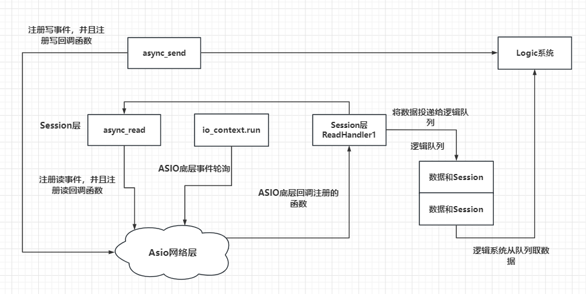

# Boost 库

> https://www.boost.org/ 官方网站 
>
> Documents里有很多案例

## ASIO

### 常用类

##### io_context

> io_service是老版本的，为了更好地反映其作为异步操作执行上下文的角色，这个类被重命名为 `io_context`。功能一致

**同步IO主要执行流程**

io_context对象是asio框架中的**调度器**，所有异步io事件都是通过它来分发处理的（io对象的构造函数中都需要传入一个io_service对象）。在同步事件中会使用一个默认的

1. 您的程序通过调用I / O对象(这里是socket)来启动连接操作

   ```cpp
   socket.connect(server_endpoint);
   ```

2. I / O对象将请求转发到io_context。

3. io_context**调用操作系统**来执行连接操作。

4. 操作系统将操作的结果返回给io_context。

5. io_context将由操作导致的任何错误转换为boost :: system :: error_code类型的对象,传给IO对象

6. 如果操作失败，则I / O对象将引发类型boost :: system :: system_error的异常。

```cpp
boost::system::error_code ec;
socket.connect(server_endpoint, ec);
```

**异步IO主要执行流程**

1. 您的程序通过调用I / O对象来启动连接操作

   ```cpp
   socket.async_connect(server_endpoint, your_completion_handler);
   ```

   其中 your_completion_handler为一个回调函数

2. I / O对象将请求转发到io_context。

3. io_context向操作系统发出应该启动异步连接的信号

   

4. 操作系统通过将结果放在一个队列上来指示连接操作已经完成，等待io上下文拾取。
   您的程序必须调用io context::run()(或一个类似的io context成员函数)，以便检索结果。当有未完成的异步操作时，对io context::run()的调用会**阻塞**，所以通常会在开始第一个异步操作时调用它。

5. 在对io上下文::run()的调用中，io上下文将操作的**结果取出队列**，将其转换为错误代码，然后将其传递给完成处理程序（回调函数）


##### **io_context::work**

`io_context::work` 是 Boost.Asio 库中的一个类，它的主要作用是告知 `io_context` 对象何时开始和结束工作。这个类确保了 `io_context` 对象的 `run()` 方法不会在有未完成的工作时退出，并且当没有剩余的未完成工作时会退出。`io_context::work` 类是可复制构造的，因此它可以用作处理器类的数据成员。

简单来说作用就是让程序员不需要担心io_context会直接退出，继续等待任务的注册。

```cpp
io_context::work w(ioc);
w.reset();
```

在构造时注册，`reset`已经被抛弃了，它实际是将work重启，建议通过析构将work取消


---


##### socket

```cpp
asio::io_context  ios;
asio::ip::tcp protocol = asio::ip::tcp::v4();

asio::ip::tcp::socket sock(ios);

boost::system::error_code ec;

sock.open(protocol, ec);
if (ec.value() != 0) {
	// Failed to open the socket.
	std::cout
		<< "Failed to open the socket! Error code = "
		<< ec.value() << ". Message: " << ec.message();
	return ec.value();
}
```

注意：在新版boost库中，asio::ip:tcp::socket无需手动open，在创建后会自动打开。

**socket无法拷贝**


##### acceptor

boost的acceptor融合了很多tcp连接的步骤、分别有bind、listen、accept三个步骤，其中listen和accept，其中的fd转换、缓冲区转换都被封装在了accept中，使用起来更加方便

```cpp
	unsigned short port_num = 3333;

	asio::ip::tcp::endpoint ep(asio::ip::address_v4::any(),port_num);
//create and open
	asio::io_context ios;

	asio::ip::tcp protocol = asio::ip::tcp::v6();

	asio::ip::tcp::acceptor acceptor(ios);

	boost::system::error_code ec;

	acceptor.open(protocol, ec);

	if (ec.value() != 0) {
		// Failed to open the socket.
		std::cout
			<< "Failed to open the acceptor socket!"
			<< "Error code = "
			<< ec.value() << ". Message: " << ec.message();
		return ec.value();
	}
//bind
	acceptor.bind(ep, ec);
	// Handling errors if any.
	if (ec.value() != 0) {
		// Failed to bind the acceptor socket. Breaking
		// execution.
		std::cout << "Failed to bind the acceptor socket."
			<< "Error code = " << ec.value() << ". Message: "
			<< ec.message();

		return ec.value();
	}
```

注意：上面的方式是分离完成绑定的，下面的方式可以简单完成acceotor的创建、打开和绑定,接受3333端口的请求

```cpp
try{
	asio::ip::acceptor a(ios,asio::ip::tcp::endlport(aiso::ip::tcp::v4(),3333));  
}
catch(system::system_error& e){
    //...
}
```

并通过try-catch 对error进行捕获,保证安全


**监听连接并接受，交由socket进行处理**

```cpp
a.accept(sock);
//sock->read_some
//sock->write_some
```


---

##### :thought_balloon: epoll联想

> linux epoll 模型| windows iocp 模型

boost的asio与epoll的关系。

epoll实现的服务器常见操作有三步，**创建epoll实例epoll_create1、注册（监听连接、读、写）事件epoll_ctl(epollfd, EPOLL_CTL_ADD, listen_sock, &event);、等待事件的发生epoll_wait**，然后再处理连接、读、写，处理业务。


boost实现`proactor模型`异步io的操作（猜测)，是如下封装：`io_context`来替代`epoll` 实例来管理事件，`async_read` `async_write`是封装了  `epoll_ctl(epollfd,EPOLL_CTL_ADD,w_r_sock,&event)`的一系列注册操作后直接返回，然后`io_context.run()`进入`epoll_wait`的无限循环，事件就绪-wait返回后"交由os"（这里应该是模拟交由os处理，实际是自身通过send receive实现的）完成读写，后调用异步读写的回调函数。

其他的异步操作应该也是如此思路。

---


##### endpoint

终端节点，简单来说就是，客户端用来**连接Connect**服务器，服务端用来**绑定Bind**监听

`endpoint`需要`asio::ip::address`，作为服务端可以使用`asio::ip::address_v4().any()`来接受所有的ip地址

##### error

`system_error`包含了一个 `error_code` 对象，可以使用这个对象来获取错误码的值和类别。 ，在error_code作为参数传入的时候，其实也是捕获到system_error，然后对error_code进行赋值，然后再返回。


##### asio::buffer

设计理念：

 boost::asio提供了`asio::mutable_buffer` 和 `asio::sconst_buffer`这两个结构，他们是一段连续的空间，首字节存储了后续数据的长度。 `asio::mutable_buffer`用于写服务，`asio::const_buffer`用于读服务。


就使用而言，根据输入参数，返回读buffer --`asio::const_buffers_1`，和写buffer--`mutable_buffers_1`

```cpp
asio::const_buffers_1 cb1=asio::buffer("hello world!");

string str("hello world!");
std::vector<char> v1(str.begin(),str.end());
asio::mutable_buffers_1 mb1=asio::buffer(v1);

const size_t  BUF_SIZE_BYTES = 20;
std::unique_ptr<char[] > buf(new char[BUF_SIZE_BYTES]);
auto input_buf = asio::buffer(static_cast<void*>(buf.get()), BUF_SIZE_BYTES);
```

---

##### uuid

当使用容器管理智能指针的时候，常需要id来标识指针，控制其释放

```c++
#include <boost/uuid/uuid.hpp>
#include <boost/uuid/uuid_generators.hpp>
#include <boost/uuid/uuid_io.hpp>
boost::uuids::uuid  a_uuid = boost::uuids::random_generator()();
string _uuid = boost::uuids::to_string(a_uuid);
```

---

##### signal

信号处理，捕获再处理，多用于程序的关闭。

**signal_set**信号集

```cpp
 boost::asio::signal_set signals(io_context, SIGINT, SIGTERM);
        signals.async_wait([&io_context](auto, auto) {
            io_context.stop();
            });
//注册几个，回调函数入参填几个
```

这边是不是可以做区别操作？

拓展：C风格的信号处理退出，常在**主线程创建子线程用于业务启动**，主线程join等待子线程关闭，完成一系列结束操作并资源释放，优雅退出。

---

##### strand

> 用于在多线程环境中保持一组任务的有序性。即使任务在不同的线程上执行，`strand`也能保证它们按照发起任务时的顺序执行。这避免了在任务中放置大量的同步代码，使得代码更易于编写并且在获得性能提升的同时更加方便

常用方法：

1. post

   ```cpp
   strand.post(some_function);
   strand.post(boost::bind(&some_class::some_method, &some_object, arg1, arg2));
   ```

2. wrap

   ```cpp
   auto wrapped_handler = strand.wrap(boost::bind(&some_class::some_method, &some_object, arg1, arg2));
   // 使用wrapped_handler作为某个异步操作的完成handler
   ```

3. bind_executor

   ```cpp
   my_socket.async_read_some(my_buffer,
       boost::asio::bind_executor(my_strand,
           [](error_code ec, size_t length)
           {
               // 处理异步读取结果
           }));
   ```

三种方式的应用场景

1. **`strand::post`**：
   - `strand::post`是直接将一个任务提交到`io_service`，由`strand`保证这些任务不会并发执行，并且按照它们被提交的顺序执行。
   - 使用`strand::post`时，任务会被排队，然后在`io_service`的某个线程中执行。
2. **`strand::wrap`**：
   - `strand::wrap`用于创建一个新的handler，这个handler被`strand`包装过，确保当这个handler被调用时，它将在`strand`所关联的`io_service`上顺序执行。
   - `strand::wrap`通常用于异步操作的完成处理程序，以确保回调函数按照顺序执行。
3. **`boost::asio::bind_executor`**：
   - `boost::asio::bind_executor`用于将一个执行器（如`strand`）绑定到一个handler上，当这个handler被调用时，它会在指定的执行器上执行。
   - 与`strand::wrap`相比，`bind_executor`提供了更灵活的绑定方式，允许将任何执行器绑定到handler上，而不仅仅是`strand`。
   - `bind_executor`通常用于需要将异步操作的完成处理程序绑定到特定执行器的场景，以确保处理程序在正确的上下文中执行。

总结来说，`strand::post`和`strand::wrap`主要用于`strand`对象，以确保任务或回调函数的顺序执行和线程安全。而`boost::asio::bind_executor`提供了一种更通用的方法，允许将任何执行器绑定到handler上，以确保异步操作的完成处理程序在正确的执行器上执行


---

### 同步读写

##### 同步写

`write_some`

返回发送的长度，循环发送，更多运用于异步发送。由于buffer是用户区的缓冲区，而TCP的缓冲区是在内核里的，这就会导致的想要发送的长度，受限于TCP缓冲区，当TCP缓冲区存留了一定的数据小于用户缓冲区，就会导致write只能发送一部分数据

```cpp
std::string buf = "Hello World!";
	std::size_t  total_bytes_written = 0;
	//循环发送
	//write_some返回每次写入的字节数
	//total_bytes_written是已经发送的字节数。
	//每次发送buf.length()- total_bytes_written)字节数据
	
	while (total_bytes_written != buf.length()) {
		total_bytes_written += sock.write_some(
			asio::buffer(buf.c_str()+total_bytes_written, 
				buf.length()- total_bytes_written));
	}
```

**`send` `write`**

> 相对于write_some他们不需要知道缓冲区发了几次才将数据发送出去，只关注完整数据是否发送成功.
>
> 而write比send更加灵活，send只能用于socket的内容发送，**是write_some的封装**，write可以接受别的IO对象的fd

```cpp
sock.send(aiso::buffer("hello world!"));
asio::write(sock,asio::buffer("hello world!"));
```

##### 同步读

`read_some`

> 循环读取，类似于write_some，但对于写，循环读取更加常用

```cpp
//assume that size of message is 10 byte;
const size_t MESSAGE_SIZE=10;
char buf[MESSAGE_SIZE];
size_t read_size=0;
vector<char> v1;
while(read_size != MESSAGE_SIZE){
   read_size +=sock.read_some(asio::buffer(buf+read_size,MESSAGE_SIZE-read_size));
}
cout << buf<<endl;
```

`receive`、`read`

> 逻辑和`send` `write`完全一致

`read_until` 

> 顾名思义 读到一个设定符号就停止


:warning: mutable_buffer可以接受容器来初始化，但是值得注意的是，**必须对容器进行初始化，获得实际内存**，不能依赖容器的自动扩容特性。特别是读时，会容易忘记

Ex: `boost::asio::transfer_at_least（uint n）` 至少n个字节 ，可以配合read-wirte使用 

---

### 异步读写

:warning:异步是不能通过return来返回成功发送、接受大小的，因为它不会阻塞线程，直接返回，所以设计其通过handler来传递成功大小。

#### 异步写

1. `async_write`

2. `async_write_some`

   > 异步写是无法保证发送的顺序的，在同步write_some常用的for来保证数据传输完成用于异步时，不加控制很可能产生hello hello world！ world！ 的错误，但我可能只是想发送一个hello world!原因是发送缓冲区现有free 空间<发送内容大小

   解决：队列，保证应用层发送顺序https://gitbookcpp.llfc.club/sections/cpp/boost/asio09.html

   ⭐⭐⭐重要思路：队列的先入先出特性保证读写的顺序

   ```cpp
   //原型
   BOOST_ASIO_COMPLETION_TOKEN_FOR(void (boost::system::error_code,
           std::size_t)) WriteToken
             BOOST_ASIO_DEFAULT_COMPLETION_TOKEN_TYPE(executor_type)>
     BOOST_ASIO_INITFN_AUTO_RESULT_TYPE_PREFIX(WriteToken,
         void (boost::system::error_code, std::size_t))
     async_write_some(const ConstBufferSequence& buffers,
         BOOST_ASIO_MOVE_ARG(WriteToken)token
           BOOST_ASIO_DEFAULT_COMPLETION_TOKEN(executor_type))
   ```

   简单来说，就是需要两个参数：

   一个是const ConstBufferSequence& buffers 

   一个是函数指针token，在完成`async_write_some`或出现错误时，调用该函数`function<void(boost::system::error_code ec, std::size_t bytes_transferred)>`

3. `async_send`

   多次调用`async_write_some`的封装。注意一定不要和`async_write_some`混合使用会产生顺序错乱问题。

**三者关系和同步写是一致的**

---

#### 异步读

1. **`async_read`**：
   - `async_read` 函数用于从套接字异步读取固定大小的数据到一个或多个缓冲区。
   - 它要求提供的缓冲区序列的总大小至少与要读取的数据大小相匹配。
   - 如果读取的数据量小于请求的数据量，它将抛出一个 `boost::asio::error::eof` 异常，除非遇到其他错误。
2. **`async_read_some`**：
   - `async_read_some` 函数用于从套接字异步读取任意数量的数据到一个或多个缓冲区。
   - 它不会抛出 `boost::asio::error::eof` 异常，即使读取的数据量小于请求的数据量。
   - 这个函数适合于不确定要读取多少数据，或者只想读取套接字当前可用的数据。
3. **`async_receive`**：
   - `async_receive` 函数专门用于 **TCP 套接字**，它将异步读取数据到一个或多个缓冲区，直到遇到 EOF（文件结束标志）或遇到错误。
   - 它的行为类似于 `async_read`，但是它在读取到 EOF 时会返回，而 `async_read` 需要你手动处理 EOF 的情况。
   - 内部实现，是`async_read_some`的多次调用，切忌和其混合使用

**注意：**eof == end of file

**推荐**：使用`async_send`发送，`async_read_some`接收，因为写错误在本机分析比较容易，所以我只需要知道是否发送成功即可，而接受端需要考虑网络原因，使用`async_receive`不好对接受到的数据进行观测。

---

### 协程

> coroutine 应用级别的进程。其**设计初衷**是想要兼备**异步编程的程序执行效率**，和**同步编程的可读性、易用性**，是在异步的基础上降低编程成本。
>
> 最终效果：代码使用异步函数，却无需回调，增加协程的关键字，实现**类同步编程**的效果
>
> 注意:协程是无法使用cpu的多核优势的

##### 

##### 关键字 

- **awaitable**<return type> function(){};  声明函数为可等待的函数
- **co_await** aync_function(...,**use_awaitable**);  以协程方式执行异步函数
  - co_await 接受返回值
  - use_awaitable 传递回调

- **co_spawn**(executor, function,option) 生成一个协程执行function；option里有**detached**

:warning: 注意：

- **`executor`** 是一个比io_context更抽象的概念，用于表示任务的执行环境和任务调度策略。
- 它是 `io_context` 的一部分，但 `io_context` 是一种具体的 `executor`。

⛈️ 猜测：协程是将回调函数封装进了use_awaitable模版函数内

```c++
#include <boost/asio/co_spawn.hpp>
#include <boost/asio/detached.hpp>
```


---

### 逻辑层

1. 模板单例类
2. 消息队列
3. 信号捕获，优雅退出




---

### 设计模型

> 基于proactor模型设计

- 读写时，会自动填充buffer


**question：**为什么session需要有server的指针？

为了让session本身，在发生错误时，调用server clearSession的方法释放内存。

**question：**当读写handler都进入了，发生错误时是否存在double free的问题？

不会，因为参数传递进来是值传递，当读写一端释放，另一端也会因为拷贝至少会保留计数1，保证本session的存活。

---

### 应用

#### Protobuf

> 用于服务器之间的序列化工具，将内容压缩至二进制，通信更加快速，但可读性很差，常用于rpc通信中，比如grpc、tars都使用了Protobuf

protobuf也能快速生产类的源文件，供收发双方使用

#### jsoncpp

> json格式常用于前后端的交互中，后端服务器的收发，json性能比protobuf差很多

jsoncpp 库的特点包括：

1. 轻量级：JSON 解析器和序列化器都非常快速，不会占用太多的 CPU 和内存资源；
2. 易于使用：提供简单的 API，易于理解和使用；
3. 可靠性高：经过广泛测试，已被许多企业和开发者用于生产环境中；
4. 开源免费：遵循 MIT 许可证发布，使用和修改均免费。


## Beast

> Portable HTTP, WebSocket, and network operations using only C++11 and Boost.Asio

### 常用类


##### request

##### response

##### flat_buffer

##### ostream


##### HTTP和WebSocket

- HTTP 使用==**请求 - 响应模型**==。客户端（通常是浏览器）发起请求，服务器响应请求并返回数据。以下是 HTTP 协议的几个关键特点：
  1. **无状态**：每个 HTTP 请求都是独立的，服务器不会记录以前的请求信息。也就是说，服务器不会根据之前发送的请求来处理当前请求。
  2. **基于文本**：HTTP 请求和响应的头部信息是基于文本的，以明文形式传输，便于人类阅读和调试。
  3. **请求方法**：HTTP 定义了多种请求方法，如 GET、POST、PUT、DELETE 等。GET 用于从服务器获取数据，POST 用于向服务器发送数据。

- WebSocket 具有以下特点：
  1. ==**全双工通信**==：在一个连接中，客户端和服务器可以同时双向发送数据。例如，在一个多人在线游戏中，服务器可以实时向所有连接的客户端发送游戏状态更新，同时客户端也可以向服务器发送玩家的操作信息。
  2. **长连接**：一旦建立连接，就可以一直保持，不需要像 HTTP 那样每次请求都建立新的连接。这减少了握手的时间和网络资源的占用。
  3. **数据帧**：WebSocket 使用二进制帧或文本帧来传输数据，比基于文本的 HTTP 更高效。这对于传输二进制数据（如图片、音频流）非常有利。

Idea ：WebSocket是基于TCP协议，需求（服务器主动给客户端发送）驱动的产物。
