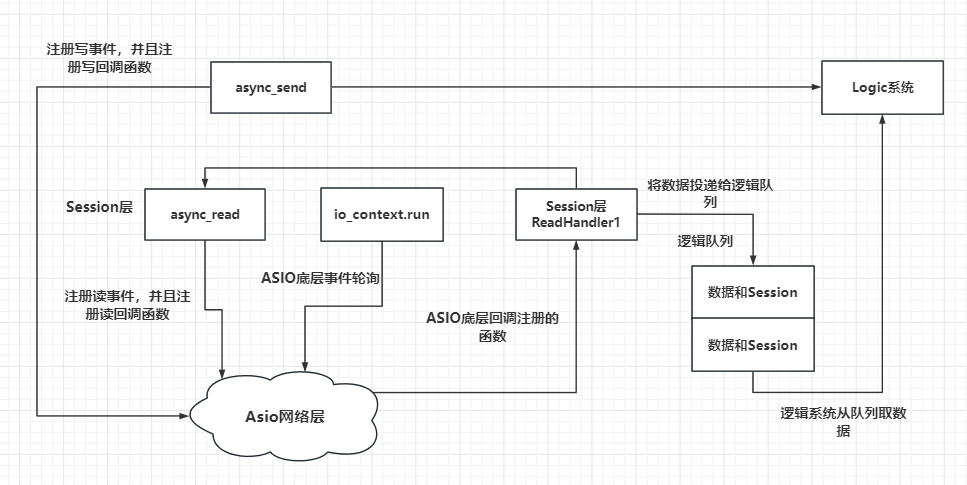

# 网络编程

### I/O 多路复用

https://mp.weixin.qq.com/s/Qpa0qXxuIM8jrBqDaXmVNA

##### socket

##### select、poll

##### epoll

### Reactor和Proactor

需要记住的是：

##### Reactor模式

1. **同步非阻塞I/O**：Reactor模式通常用于同步非阻塞I/O操作。在这种模式下，I/O操作（如读或写）在被调用时不会立即完成，而是立即返回，稍后当I/O操作可以继续进行时，事件处理器会被调用。
2. **事件通知**：当I/O操作准备就绪时，Reactor会通知相应的事件处理器（或回调函数）来处理事件。
3. **用户空间处理**：在Reactor模式中，一旦事件被触发，事件处理器需要在用户空间完成所有的I/O操作，包括从非阻塞I/O调用中获取数据。
4. **事件循环**：Reactor模式通常有一个事件循环，不断地检查I/O事件，并分派事件处理器。

##### Proactor模式

1. **异步I/O**：Proactor模式用于异步I/O操作，这意味着I/O操作（如读或写）被发起后，操作系统会接管并完成I/O操作，而不需要用户程序的进一步干预。
2. **操作系统完成I/O**：在Proactor模式中，**I/O操作是由操作系统在后台线程中完成**的，当操作完成后，操作系统会通知应用程序。
3. **回调在操作系统层面**：Proactor模式中的回调通常在操作系统层面被触发，这意味着当I/O操作完成时，操作系统会直接调用回调函数。
4. **用户空间的简单性**：由于I/O操作是由操作系统完成的，用户程序在处理I/O完成事件时通常只需要处理已经完成的数据，而不需要关心I/O操作的具体细节。
5. **事件处理的延迟**：在Proactor模式中，由于I/O操作是由操作系统完成的，因此事件处理可能会有一些延迟，因为操作系统需要时间来完成I/O操作。

**总结：**

- **Reactor模式**：适用于同步非阻塞I/O，用户程序需要在用户空间完成I/O操作，事件处理器在I/O操作准备就绪时被调用。
- **Proactor模式**：适用于异步I/O，操作系统完成I/O操作，事件处理器在I/O操作完成后被调用。

**Proactor模式通常能够提供更好的性能，特别是在高并发场景下，因为它减少了用户程序需要执行的I/O操作数量**，并将I/O操作的完成处理委托给了操作系统。然而，Proactor模式的实现通常比Reactor模式更复杂，并且需要操作系统的支持。

:thought_balloon:**联想：**boost库的asio ， 在处理async读写等操作，其handler是在完成IO之后的操作，而不是去执行IO操作的函数

### 协议

#### HTTP

##### 长轮询、短轮询、websocket

https://blog.csdn.net/pacosonswjtu/article/details/52035252#:~:text=1%EF%BC%89%E4%BB%8B%E7%BB%8D%EF%BC%9A%20http

**短轮询** 是指客户端在固定的时间间隔内不断向服务器发送请求，**无论服务器是否有新的数据更新**，服务器都会**立即返回当前的状态**（**很可能数据并没有准备好）**。这种方式简单易实现，但可能会导致大量的无效请求，从而增加服务器的负担和网络延迟。

**长轮询** 是一种改进的轮询方式，客户端向服务器发送请求后，如果服务器没有新的数据，它会保持连接打开状态，**直到有数据可用或者超时**。这种方式可以减少不必要的网络请求，提高实时性，但服务器需要保持连接状态，可能会占用更多的服务器资源。

【补充】http 长连接（tcp 连接可复用）

> http协议 目前有两个版本：1.1 和 1.0；区别是 1.1支持 长连接（普遍使用http1.1版本），长连接也叫做持久连接（keep-alive）；而1.0不支持长连接，在1.0版本下，每个http请求响应后都会关闭tcp连接，下一次http请求会重新建立http连接；

2）**http 长连接**：多个http 请求共用同一个 tcp 连接，这样可以减少相邻多次 http请求导致的 tcp连接建立和关闭的资源消耗；http1.1 在请求头和响应头中用 connection 字段标识 该http连接是否是 长连接，即**connection: keep-alive 表示长连接**；而 connection: closed 表明服务器关闭tcp 连接；
3）**keep-alive**：与 connection 相对应的是 keep-alive，其属性有 **timeout=30 和 max=5** 分别是 两次 http 请求 保持的时间，max表示这个tcp 连接最多被几个 http 请求重用；

---

#### **WebSocket**

定义了一种在通过一个单一的 socket 在网络上进行**全双工通讯的通道**。

>  WebSocket 是 html5 规范发布的新协议，和 http协议完全是两个不同的概念，或者说基本没关系；WebSocket 协议 和 http协议的唯一联系点在于，WebSocket 协议为了兼容现有浏览器的握手规范而采用了 http协议中的握手规范 以建立WebSocket连接；

WebSocket 协议允许客户端和服务器之间建立一个持久的连接，**服务器**可以通过这个连接**主动向客户端推送数据**（类似于推送）。这种方式提供了真正的实时通信，减少了延迟和网络流量，适合需要高度实时性的应用程序。

解决的问题：

1. **http协议的被动性**：采用 WebSocket 协议后，服务器可以主动推送消息给客户端；而不需要客户端以（长/短）轮询的方式发起http请求到server以获取数据更新反馈；这样一来，**客户端只需要经过一次HTTP请求**，就可以做到源源不断的信息传送了（在程序设计中，这种设计叫做回调，即：server 端有信息了再来通知client 端，而不是 client 端 每次都傻乎乎地跑去轮询server端 是否有消息更新）；
2. **http协议的无状态性/健忘性**：短轮询是每次http请求前都要建立连接，而长轮询是相邻几次请求前都要建立连接；http请求响应完成后，服务器就会断开连接，且把连接的信息全都忘记了；所以每次建立连接都要重新传输连接上下文（下面有补充），将 client 端的连接上下文来告诉server 端；而 WebSockct只需要一次HTTP 握手，整个通讯过程是建立在一次连接（状态）中的，server 端会一直推送消息更新反馈到客户端，直到客户端关闭请求，这样就无需 客户端为发送消息而建立不必要的 tcp 连接 和 为了建立tcp连接而发送不必要的冗余的连接上下文消息；

---

### 设计思路

> 参考boost库学习 https://gitbookcpp.llfc.club/sections/cpp/boost/asio05.html

#### :warning: 同步服务器(生产不用)

- **handleFunc** :用于处理请求服务
- **acceptor** :用于接受请求

为什么不用？

1. 同步读写的缺陷在于读写是**阻塞的**，如果客户端对端不发送数据服务器的read操作是阻塞的，这将导致服务器处于阻塞等待状态。
2.  可以通过**开辟新的线程**为新生成的连接处理读写，但是一个进程开辟的线程是**有限的**，约为2048个线程，在Linux环境可以通过unlimit增加一个进程开辟的线程数，但是线程过多也会导致切换消耗的时间片较多。 
3. 该服务器和客户端为**应答式**，实际场景为全双工通信模式，发送和接收要独立分开。 
4. 该服务器和客户端未考虑粘包处理。 综上所述，是我们这个服务器和客户端存在的问题

但有一个思路可以借鉴

用队列保证

---

> 为解决上述问题，我们在接下里的文章里做不断完善和改进，主要以异步读写改进上述方案。 当然同步读写的方式也有其优点，比如客户端连接数不多，而且服务器并发性不高的场景，可以使用同步读写的方式。使用同步读写能简化编码难度。

#### ⭐异步服务器

> 参考boost学习https://gitbookcpp.llfc.club/sections/cpp/boost/asio06.html

**必要组件**

**Server：**

- 监听，async_accept
- 接受连接 , acceptHandler
- 创建、回收会话 start_accept 、doClose

**Session:**

- 读 doRead readHandler
- 写 doWrite writeHandler
- 业务 service 也就是服务器为什么称之为服务器的地方

##### 问题处理

1. 如何全双工通讯

   读队列+写队列来实现全双工通讯。不用单队列+符号的原因是

2. 如何健壮地处理空间

   - 读、写、监听，用户端关闭，产生的多次析构问题

     思路：

     > https://gitbookcpp.llfc.club/sections/cpp/boost/asio08.html
     
     - 在读写监听都对异常有处理的情况：延长Session的生命周期defer，保证Session在退出handler前的存活，最后引用计数为0时，由智能指针释放空间
     
     如果我交由监听全权负责释放空间，读写只抛出异常，不处理会有什么问题？
     
     例：当我有两个函数都抛出了异常（这在多线程、异步的程序里都很常见），就会产生double free的错误。

3. 粘包问题

   > 何为粘包问题？
   >
   > 由于发送缓冲区和接受缓冲区的机制和大小的区别，会导致在读取时可能发送多个包粘连在一起读取的情况

   
   
   :warning: 在处理接收数据的时候，`_data`与接收缓冲区直接相关，更偏下层，建议与处理`buffer`进行区分开来，不要直接对`_data`进行直接的解析操作，会增加代码复杂度，且只对纯应用层的对象进行操作，更符合分层思想

​	

#### 解耦

> 对于一个庞大的系统来说，耦合是一个很需要注意的问题，如何解耦也是一个需要的能力

##### 分层思想

分层思想贯穿计算机设计中，将任务区分层数，来规范职责，这也是解耦的一大基础

例：我们常常在网络层完成asio 的 io操作，而将收到数据后的业务处理放在业务层、逻辑层。将数据丢进消息队列，逻辑层消费数据再决定是否需要io操作，这样可以避免伪阻塞的问题----handler调用下一步注册io的问题。当然这里的消费过程依旧可以区分层数，比如根据iso模型的话可以分为应用层和会话层，在处理更加复杂的问题时，分层是可以将处理过程更加清晰，后续拓展性也会更好

对应boost学习：https://gitbookcpp.llfc.club/sections/cpp/boost/asio17.html

