### 前情学习

#### 类的关系

#### 1. **继承（Inheritance）**

- **关系语义**：is-a关系（子类继承父类属性和方法）

- **代码特征**：强耦合，父类变化影响子类（如`Dog extends Animal`）。

- **Mermaid语法**

  ```mermaid
  classDiagram
      Animal <|-- Dog : 继承
  ```

  

  **箭头方向**：子类指向父类（

  ```
  <|--
  ```

------

#### 2. **实现（Realization）**

- **关系语义**：can-do关系（类实现接口方法）

- **代码特征**：松耦合，接口定义方法签名（如`Bird implements Flyable`）。

- **Mermaid语法**

  ```mermaid
  classDiagram
      Flyable <|.. Bird : 实现
      class Flyable {
          <<interface>>
          fly()
      }
  ```

  

  **箭头方向**：实现类指向接口（

  ```
  <|..
  ```

  或

  ```
  ..|>
  ```

------

#### 3. **关联（Association）**

- **关系语义**：has-a关系（类间长期引用，生命周期独立）

- **代码特征**：成员变量持有对象（如`Teacher`持有`Student`列表）。

- **Mermaid语法**：

  ```mermaid
  classDiagram
      Teacher --> Student : 关联
  ```

  <svg id="svgGraph84129159841751" width="100%" xmlns="http://www.w3.org/2000/svg" class="classDiagram" style="overflow: hidden; max-width: 100%;" role="graphics-document document" aria-roledescription="class" xmlns:xlink="http://www.w3.org/1999/xlink" xmlns:ev="http://www.w3.org/2001/xml-events"><g id="viewport-20250701024715427" class="svg-pan-zoom_viewport" transform="matrix(1.0818798196278192,0,0,1.0818798196278192,415.2102898764014,19.937510398216972)" style="transform: matrix(1.08188, 0, 0, 1.08188, 415.21, 19.9375);"><g><defs><marker id="svgGraph84129159841751_class-aggregationStart" class="marker aggregation class" refX="18" refY="7" markerWidth="190" markerHeight="240" orient="auto"><path d="M 18,7 L9,13 L1,7 L9,1 Z"></path></marker></defs><defs><marker id="svgGraph84129159841751_class-aggregationEnd" class="marker aggregation class" refX="1" refY="7" markerWidth="20" markerHeight="28" orient="auto"><path d="M 18,7 L9,13 L1,7 L9,1 Z"></path></marker></defs><defs><marker id="svgGraph84129159841751_class-extensionStart" class="marker extension class" refX="18" refY="7" markerWidth="190" markerHeight="240" orient="auto"><path d="M 1,7 L18,13 V 1 Z"></path></marker></defs><defs><marker id="svgGraph84129159841751_class-extensionEnd" class="marker extension class" refX="1" refY="7" markerWidth="20" markerHeight="28" orient="auto"><path d="M 1,1 V 13 L18,7 Z"></path></marker></defs><defs><marker id="svgGraph84129159841751_class-compositionStart" class="marker composition class" refX="18" refY="7" markerWidth="190" markerHeight="240" orient="auto"><path d="M 18,7 L9,13 L1,7 L9,1 Z"></path></marker></defs><defs><marker id="svgGraph84129159841751_class-compositionEnd" class="marker composition class" refX="1" refY="7" markerWidth="20" markerHeight="28" orient="auto"><path d="M 18,7 L9,13 L1,7 L9,1 Z"></path></marker></defs><defs><marker id="svgGraph84129159841751_class-dependencyStart" class="marker dependency class" refX="6" refY="7" markerWidth="190" markerHeight="240" orient="auto"><path d="M 5,7 L9,13 L1,7 L9,1 Z"></path></marker></defs><defs><marker id="svgGraph84129159841751_class-dependencyEnd" class="marker dependency class" refX="13" refY="7" markerWidth="20" markerHeight="28" orient="auto"><path d="M 18,7 L9,13 L14,7 L9,1 Z"></path></marker></defs><defs><marker id="svgGraph84129159841751_class-lollipopStart" class="marker lollipop class" refX="13" refY="7" markerWidth="190" markerHeight="240" orient="auto"><circle stroke="black" fill="transparent" cx="7" cy="7" r="6"></circle></marker></defs><defs><marker id="svgGraph84129159841751_class-lollipopEnd" class="marker lollipop class" refX="1" refY="7" markerWidth="190" markerHeight="240" orient="auto"><circle stroke="black" fill="transparent" cx="7" cy="7" r="6"></circle></marker></defs><g class="root"><g class="clusters"></g><g class="edgePaths"><path d="M49.719,92L49.719,98.167C49.719,104.333,49.719,116.667,49.719,128C49.719,139.333,49.719,149.667,49.719,154.833L49.719,160" id="id_Teacher_Student_1" class="edge-thickness-normal edge-pattern-solid relation" style=";" marker-end="url(#svgGraph84129159841751_class-dependencyEnd)"></path></g><g class="edgeLabels"><g class="edgeLabel" transform="translate(49.71875, 129)"><g class="label" transform="translate(-16, -12)"><foreignObject width="32" height="24"><div xmlns="http://www.w3.org/1999/xhtml" class="labelBkg" style="margin: 0px; padding: 0px; border: 0px; font-style: inherit; font-variant: inherit; font-weight: inherit; font-stretch: inherit; font-size: inherit; line-height: 1.5; font-family: inherit; font-optical-sizing: inherit; font-size-adjust: inherit; font-kerning: inherit; font-feature-settings: inherit; font-variation-settings: inherit; vertical-align: baseline; background: rgb(236, 236, 255); display: table-cell; white-space: nowrap; max-width: 200px; text-align: center;"><span class="edgeLabel" style="margin: 0px; padding: 0px; border: 0px; font-style: inherit; font-variant: inherit; font-weight: inherit; font-stretch: inherit; font-size: inherit; line-height: inherit; font-family: inherit !important; font-optical-sizing: inherit; font-size-adjust: inherit; font-kerning: inherit; font-feature-settings: inherit; font-variation-settings: inherit; vertical-align: baseline; color: rgb(19, 19, 0); background: rgb(236, 236, 255); display: inline-block;"><p style="margin: 0px; padding: 0px; border: 0px; font-style: inherit; font-variant: inherit; font-weight: 400; font-stretch: inherit; font-size: 16px; line-height: 1.75; font-family: inherit; font-optical-sizing: inherit; font-size-adjust: inherit; font-kerning: inherit; font-feature-settings: inherit; font-variation-settings: inherit; vertical-align: baseline; word-break: break-word; overflow-wrap: break-word;">关联</p></span></div></foreignObject></g></g></g><g class="nodes"><g class="node default" id="classId-Teacher-350" transform="translate(49.71875, 50)"><g class="basic label-container"><path d="M-41.71875 -42 L41.71875 -42 L41.71875 42 L-41.71875 42" stroke="none" stroke-width="0" fill="#ECECFF" style=""></path><path d="M-41.71875 -42 C-24.432656156627186 -42, -7.146562313254371 -42, 41.71875 -42 M-41.71875 -42 C-11.350133736488242 -42, 19.018482527023515 -42, 41.71875 -42 M41.71875 -42 C41.71875 -14.011354989632327, 41.71875 13.977290020735346, 41.71875 42 M41.71875 -42 C41.71875 -12.418194506607513, 41.71875 17.163610986784974, 41.71875 42 M41.71875 42 C23.36326486210262 42, 5.007779724205243 42, -41.71875 42 M41.71875 42 C16.679856883340943 42, -8.359036233318115 42, -41.71875 42 M-41.71875 42 C-41.71875 9.40194233037365, -41.71875 -23.1961153392527, -41.71875 -42 M-41.71875 42 C-41.71875 16.272081872128492, -41.71875 -9.455836255743016, -41.71875 -42" stroke="#9370DB" stroke-width="1.3" fill="none" style=""></path></g><g class="annotation-group text" transform="translate(0, -18)"></g><g class="label-group text" transform="translate(-29.71875, -18)"><g class="label" style="font-weight: bolder" transform="translate(0,-12)"><foreignObject width="59.4375" height="24"><div xmlns="http://www.w3.org/1999/xhtml" style="margin: 0px; padding: 0px; border: 0px; font-style: inherit; font-variant: inherit; font-weight: inherit; font-stretch: inherit; font-size: inherit; line-height: 1.5; font-family: inherit; font-optical-sizing: inherit; font-size-adjust: inherit; font-kerning: inherit; font-feature-settings: inherit; font-variation-settings: inherit; vertical-align: baseline; display: table-cell; white-space: nowrap; max-width: 110px; text-align: center;"><span class="nodeLabel markdown-node-label" style="margin: 0px; padding: 0px; border: 0px; font-style: inherit; font-variant: inherit; font-weight: inherit; font-stretch: inherit; font-size: inherit; line-height: inherit; font-family: inherit !important; font-optical-sizing: inherit; font-size-adjust: inherit; font-kerning: inherit; font-feature-settings: inherit; font-variation-settings: inherit; vertical-align: baseline; color: rgb(19, 19, 0);"><p style="margin: 0px; padding: 0px; border: 0px; font-style: inherit; font-variant: inherit; font-weight: 400; font-stretch: inherit; font-size: 16px; line-height: 1.75; font-family: inherit; font-optical-sizing: inherit; font-size-adjust: inherit; font-kerning: inherit; font-feature-settings: inherit; font-variation-settings: inherit; vertical-align: baseline; word-break: break-word; overflow-wrap: break-word;">Teacher</p></span></div></foreignObject></g></g><g class="members-group text" transform="translate(-29.71875, 30)"></g><g class="methods-group text" transform="translate(-29.71875, 60)"></g><g class="divider" style=""><path d="M-41.71875 6 C-24.836110625234806 6, -7.953471250469612 6, 41.71875 6 M-41.71875 6 C-18.45103817754608 6, 4.816673644907837 6, 41.71875 6" stroke="#9370DB" stroke-width="1.3" fill="none" style=""></path></g><g class="divider" style=""><path d="M-41.71875 24 C-23.835560891175234 24, -5.952371782350468 24, 41.71875 24 M-41.71875 24 C-14.364751711477155 24, 12.98924657704569 24, 41.71875 24" stroke="#9370DB" stroke-width="1.3" fill="none" style=""></path></g></g><g class="node default" id="classId-Student-351" transform="translate(49.71875, 208)"><g class="basic label-container"><path d="M-41.125 -42 L41.125 -42 L41.125 42 L-41.125 42" stroke="none" stroke-width="0" fill="#ECECFF" style=""></path><path d="M-41.125 -42 C-17.633694252847587 -42, 5.857611494304827 -42, 41.125 -42 M-41.125 -42 C-12.281213781947528 -42, 16.562572436104944 -42, 41.125 -42 M41.125 -42 C41.125 -19.770645065196142, 41.125 2.4587098696077163, 41.125 42 M41.125 -42 C41.125 -12.5517559534393, 41.125 16.8964880931214, 41.125 42 M41.125 42 C8.86753195714865 42, -23.3899360857027 42, -41.125 42 M41.125 42 C13.492114579095745 42, -14.14077084180851 42, -41.125 42 M-41.125 42 C-41.125 8.746248906655204, -41.125 -24.507502186689592, -41.125 -42 M-41.125 42 C-41.125 22.828038711154935, -41.125 3.6560774223098704, -41.125 -42" stroke="#9370DB" stroke-width="1.3" fill="none" style=""></path></g><g class="annotation-group text" transform="translate(0, -18)"></g><g class="label-group text" transform="translate(-29.125, -18)"><g class="label" style="font-weight: bolder" transform="translate(0,-12)"><foreignObject width="58.25" height="24"><div xmlns="http://www.w3.org/1999/xhtml" style="margin: 0px; padding: 0px; border: 0px; font-style: inherit; font-variant: inherit; font-weight: inherit; font-stretch: inherit; font-size: inherit; line-height: 1.5; font-family: inherit; font-optical-sizing: inherit; font-size-adjust: inherit; font-kerning: inherit; font-feature-settings: inherit; font-variation-settings: inherit; vertical-align: baseline; display: table-cell; white-space: nowrap; max-width: 108px; text-align: center;"><span class="nodeLabel markdown-node-label" style="margin: 0px; padding: 0px; border: 0px; font-style: inherit; font-variant: inherit; font-weight: inherit; font-stretch: inherit; font-size: inherit; line-height: inherit; font-family: inherit !important; font-optical-sizing: inherit; font-size-adjust: inherit; font-kerning: inherit; font-feature-settings: inherit; font-variation-settings: inherit; vertical-align: baseline; color: rgb(19, 19, 0);"><p style="margin: 0px; padding: 0px; border: 0px; font-style: inherit; font-variant: inherit; font-weight: 400; font-stretch: inherit; font-size: 16px; line-height: 1.75; font-family: inherit; font-optical-sizing: inherit; font-size-adjust: inherit; font-kerning: inherit; font-feature-settings: inherit; font-variation-settings: inherit; vertical-align: baseline; word-break: break-word; overflow-wrap: break-word;">Student</p></span></div></foreignObject></g></g><g class="members-group text" transform="translate(-29.125, 30)"></g><g class="methods-group text" transform="translate(-29.125, 60)"></g><g class="divider" style=""><path d="M-41.125 6 C-20.903956589806057 6, -0.6829131796121146 6, 41.125 6 M-41.125 6 C-17.55153387044581 6, 6.021932259108382 6, 41.125 6" stroke="#9370DB" stroke-width="1.3" fill="none" style=""></path></g><g class="divider" style=""><path d="M-41.125 24 C-21.800688984406275 24, -2.4763779688125496 24, 41.125 24 M-41.125 24 C-23.554052090574718 24, -5.983104181149436 24, 41.125 24" stroke="#9370DB" stroke-width="1.3" fill="none" style=""></path></g></g></g></g></g></g></svg>

  **箭头方向**：单向或双向（

  ```
  -->
  ```

  或

  ```
  <--
  ```

------

#### 4. **聚合（Aggregation）**

- **关系语义**：弱whole-part关系（部分可独立于整体存在）**new 出来的成员变量**

- **代码特征**：整体通过构造函数传入部分（如`Department`聚合`Employee`）。

- **Mermaid语法：**

  ```mermaid
  classDiagram
      Department o-- Employee : 聚合
  ```

  <svg id="svgGraph12871205203392" width="100%" xmlns="http://www.w3.org/2000/svg" class="classDiagram" style="overflow: hidden; max-width: 100%;" role="graphics-document document" aria-roledescription="class" xmlns:xlink="http://www.w3.org/1999/xlink" xmlns:ev="http://www.w3.org/2001/xml-events"><g id="viewport-20250701024719453" class="svg-pan-zoom_viewport" transform="matrix(1.0818798196278192,0,0,1.0818798196278192,399.09197241422316,19.937510398216972)" style="transform: matrix(1.08188, 0, 0, 1.08188, 399.092, 19.9375);"><g><defs><marker id="svgGraph12871205203392_class-aggregationStart" class="marker aggregation class" refX="18" refY="7" markerWidth="190" markerHeight="240" orient="auto"><path d="M 18,7 L9,13 L1,7 L9,1 Z"></path></marker></defs><defs><marker id="svgGraph12871205203392_class-aggregationEnd" class="marker aggregation class" refX="1" refY="7" markerWidth="20" markerHeight="28" orient="auto"><path d="M 18,7 L9,13 L1,7 L9,1 Z"></path></marker></defs><defs><marker id="svgGraph12871205203392_class-extensionStart" class="marker extension class" refX="18" refY="7" markerWidth="190" markerHeight="240" orient="auto"><path d="M 1,7 L18,13 V 1 Z"></path></marker></defs><defs><marker id="svgGraph12871205203392_class-extensionEnd" class="marker extension class" refX="1" refY="7" markerWidth="20" markerHeight="28" orient="auto"><path d="M 1,1 V 13 L18,7 Z"></path></marker></defs><defs><marker id="svgGraph12871205203392_class-compositionStart" class="marker composition class" refX="18" refY="7" markerWidth="190" markerHeight="240" orient="auto"><path d="M 18,7 L9,13 L1,7 L9,1 Z"></path></marker></defs><defs><marker id="svgGraph12871205203392_class-compositionEnd" class="marker composition class" refX="1" refY="7" markerWidth="20" markerHeight="28" orient="auto"><path d="M 18,7 L9,13 L1,7 L9,1 Z"></path></marker></defs><defs><marker id="svgGraph12871205203392_class-dependencyStart" class="marker dependency class" refX="6" refY="7" markerWidth="190" markerHeight="240" orient="auto"><path d="M 5,7 L9,13 L1,7 L9,1 Z"></path></marker></defs><defs><marker id="svgGraph12871205203392_class-dependencyEnd" class="marker dependency class" refX="13" refY="7" markerWidth="20" markerHeight="28" orient="auto"><path d="M 18,7 L9,13 L14,7 L9,1 Z"></path></marker></defs><defs><marker id="svgGraph12871205203392_class-lollipopStart" class="marker lollipop class" refX="13" refY="7" markerWidth="190" markerHeight="240" orient="auto"><circle stroke="black" fill="transparent" cx="7" cy="7" r="6"></circle></marker></defs><defs><marker id="svgGraph12871205203392_class-lollipopEnd" class="marker lollipop class" refX="1" refY="7" markerWidth="190" markerHeight="240" orient="auto"><circle stroke="black" fill="transparent" cx="7" cy="7" r="6"></circle></marker></defs><g class="root"><g class="clusters"></g><g class="edgePaths"><path d="M64.617,110L64.617,113.167C64.617,116.333,64.617,122.667,64.617,132C64.617,141.333,64.617,153.667,64.617,159.833L64.617,166" id="id_Department_Employee_1" class="edge-thickness-normal edge-pattern-solid relation" style=";" marker-start="url(#svgGraph12871205203392_class-aggregationStart)"></path></g><g class="edgeLabels"><g class="edgeLabel" transform="translate(64.6171875, 129)"><g class="label" transform="translate(-16, -12)"><foreignObject width="32" height="24"><div xmlns="http://www.w3.org/1999/xhtml" class="labelBkg" style="margin: 0px; padding: 0px; border: 0px; font-style: inherit; font-variant: inherit; font-weight: inherit; font-stretch: inherit; font-size: inherit; line-height: 1.5; font-family: inherit; font-optical-sizing: inherit; font-size-adjust: inherit; font-kerning: inherit; font-feature-settings: inherit; font-variation-settings: inherit; vertical-align: baseline; background: rgb(236, 236, 255); display: table-cell; white-space: nowrap; max-width: 200px; text-align: center;"><span class="edgeLabel" style="margin: 0px; padding: 0px; border: 0px; font-style: inherit; font-variant: inherit; font-weight: inherit; font-stretch: inherit; font-size: inherit; line-height: inherit; font-family: inherit !important; font-optical-sizing: inherit; font-size-adjust: inherit; font-kerning: inherit; font-feature-settings: inherit; font-variation-settings: inherit; vertical-align: baseline; color: rgb(19, 19, 0); background: rgb(236, 236, 255); display: inline-block;"><p style="margin: 0px; padding: 0px; border: 0px; font-style: inherit; font-variant: inherit; font-weight: 400; font-stretch: inherit; font-size: 16px; line-height: 1.75; font-family: inherit; font-optical-sizing: inherit; font-size-adjust: inherit; font-kerning: inherit; font-feature-settings: inherit; font-variation-settings: inherit; vertical-align: baseline; word-break: break-word; overflow-wrap: break-word;">聚合</p></span></div></foreignObject></g></g></g><g class="nodes"><g class="node default" id="classId-Department-354" transform="translate(64.6171875, 50)"><g class="basic label-container"><path d="M-56.6171875 -42 L56.6171875 -42 L56.6171875 42 L-56.6171875 42" stroke="none" stroke-width="0" fill="#ECECFF" style=""></path><path d="M-56.6171875 -42 C-32.73424278194884 -42, -8.851298063897687 -42, 56.6171875 -42 M-56.6171875 -42 C-18.275208891074037 -42, 20.066769717851926 -42, 56.6171875 -42 M56.6171875 -42 C56.6171875 -18.716000789499535, 56.6171875 4.5679984210009295, 56.6171875 42 M56.6171875 -42 C56.6171875 -23.80561997636741, 56.6171875 -5.61123995273482, 56.6171875 42 M56.6171875 42 C27.707470085862 42, -1.2022473282760018 42, -56.6171875 42 M56.6171875 42 C15.119661886297983 42, -26.377863727404034 42, -56.6171875 42 M-56.6171875 42 C-56.6171875 24.525700764124828, -56.6171875 7.051401528249656, -56.6171875 -42 M-56.6171875 42 C-56.6171875 9.530282026966077, -56.6171875 -22.939435946067846, -56.6171875 -42" stroke="#9370DB" stroke-width="1.3" fill="none" style=""></path></g><g class="annotation-group text" transform="translate(0, -18)"></g><g class="label-group text" transform="translate(-44.6171875, -18)"><g class="label" style="font-weight: bolder" transform="translate(0,-12)"><foreignObject width="89.234375" height="24"><div xmlns="http://www.w3.org/1999/xhtml" style="margin: 0px; padding: 0px; border: 0px; font-style: inherit; font-variant: inherit; font-weight: inherit; font-stretch: inherit; font-size: inherit; line-height: 1.5; font-family: inherit; font-optical-sizing: inherit; font-size-adjust: inherit; font-kerning: inherit; font-feature-settings: inherit; font-variation-settings: inherit; vertical-align: baseline; display: table-cell; white-space: nowrap; max-width: 137px; text-align: center;"><span class="nodeLabel markdown-node-label" style="margin: 0px; padding: 0px; border: 0px; font-style: inherit; font-variant: inherit; font-weight: inherit; font-stretch: inherit; font-size: inherit; line-height: inherit; font-family: inherit !important; font-optical-sizing: inherit; font-size-adjust: inherit; font-kerning: inherit; font-feature-settings: inherit; font-variation-settings: inherit; vertical-align: baseline; color: rgb(19, 19, 0);"><p style="margin: 0px; padding: 0px; border: 0px; font-style: inherit; font-variant: inherit; font-weight: 400; font-stretch: inherit; font-size: 16px; line-height: 1.75; font-family: inherit; font-optical-sizing: inherit; font-size-adjust: inherit; font-kerning: inherit; font-feature-settings: inherit; font-variation-settings: inherit; vertical-align: baseline; word-break: break-word; overflow-wrap: break-word;">Department</p></span></div></foreignObject></g></g><g class="members-group text" transform="translate(-44.6171875, 30)"></g><g class="methods-group text" transform="translate(-44.6171875, 60)"></g><g class="divider" style=""><path d="M-56.6171875 6 C-13.226091033836646 6, 30.16500543232671 6, 56.6171875 6 M-56.6171875 6 C-22.027216836762527 6, 12.562753826474946 6, 56.6171875 6" stroke="#9370DB" stroke-width="1.3" fill="none" style=""></path></g><g class="divider" style=""><path d="M-56.6171875 24 C-25.670532229421582 24, 5.276123041156836 24, 56.6171875 24 M-56.6171875 24 C-17.080657111939573 24, 22.455873276120855 24, 56.6171875 24" stroke="#9370DB" stroke-width="1.3" fill="none" style=""></path></g></g><g class="node default" id="classId-Employee-355" transform="translate(64.6171875, 208)"><g class="basic label-container"><path d="M-48.4375 -42 L48.4375 -42 L48.4375 42 L-48.4375 42" stroke="none" stroke-width="0" fill="#ECECFF" style=""></path><path d="M-48.4375 -42 C-14.147826419779093 -42, 20.141847160441813 -42, 48.4375 -42 M-48.4375 -42 C-24.052933712749887 -42, 0.331632574500226 -42, 48.4375 -42 M48.4375 -42 C48.4375 -24.687939341362682, 48.4375 -7.375878682725364, 48.4375 42 M48.4375 -42 C48.4375 -16.12152410426494, 48.4375 9.756951791470122, 48.4375 42 M48.4375 42 C14.57736968416026 42, -19.28276063167948 42, -48.4375 42 M48.4375 42 C14.394682881578156 42, -19.64813423684369 42, -48.4375 42 M-48.4375 42 C-48.4375 20.50524830658096, -48.4375 -0.9895033868380807, -48.4375 -42 M-48.4375 42 C-48.4375 14.277132599699694, -48.4375 -13.445734800600611, -48.4375 -42" stroke="#9370DB" stroke-width="1.3" fill="none" style=""></path></g><g class="annotation-group text" transform="translate(0, -18)"></g><g class="label-group text" transform="translate(-36.4375, -18)"><g class="label" style="font-weight: bolder" transform="translate(0,-12)"><foreignObject width="72.875" height="24"><div xmlns="http://www.w3.org/1999/xhtml" style="margin: 0px; padding: 0px; border: 0px; font-style: inherit; font-variant: inherit; font-weight: inherit; font-stretch: inherit; font-size: inherit; line-height: 1.5; font-family: inherit; font-optical-sizing: inherit; font-size-adjust: inherit; font-kerning: inherit; font-feature-settings: inherit; font-variation-settings: inherit; vertical-align: baseline; display: table-cell; white-space: nowrap; max-width: 122px; text-align: center;"><span class="nodeLabel markdown-node-label" style="margin: 0px; padding: 0px; border: 0px; font-style: inherit; font-variant: inherit; font-weight: inherit; font-stretch: inherit; font-size: inherit; line-height: inherit; font-family: inherit !important; font-optical-sizing: inherit; font-size-adjust: inherit; font-kerning: inherit; font-feature-settings: inherit; font-variation-settings: inherit; vertical-align: baseline; color: rgb(19, 19, 0);"><p style="margin: 0px; padding: 0px; border: 0px; font-style: inherit; font-variant: inherit; font-weight: 400; font-stretch: inherit; font-size: 16px; line-height: 1.75; font-family: inherit; font-optical-sizing: inherit; font-size-adjust: inherit; font-kerning: inherit; font-feature-settings: inherit; font-variation-settings: inherit; vertical-align: baseline; word-break: break-word; overflow-wrap: break-word;">Employee</p></span></div></foreignObject></g></g><g class="members-group text" transform="translate(-36.4375, 30)"></g><g class="methods-group text" transform="translate(-36.4375, 60)"></g><g class="divider" style=""><path d="M-48.4375 6 C-13.857953474884809 6, 20.721593050230382 6, 48.4375 6 M-48.4375 6 C-21.811401720945582 6, 4.814696558108835 6, 48.4375 6" stroke="#9370DB" stroke-width="1.3" fill="none" style=""></path></g><g class="divider" style=""><path d="M-48.4375 24 C-16.081024810121818 24, 16.275450379756364 24, 48.4375 24 M-48.4375 24 C-22.521589119317234 24, 3.394321761365532 24, 48.4375 24" stroke="#9370DB" stroke-width="1.3" fill="none" style=""></path></g></g></g></g></g></g></svg>

  箭头方向：**部分指向整体**

  ```
  o--
  ```

------

#### 5. **组合（Composition）**

- **关系语义**：强whole-part关系（部分依赖整体生命周期）

- **代码特征**：整体创建并管理部分（如`House`组合`Room`）。

- Mermaid语法：

  ```mermaid
  classDiagram
      House *-- Room : 组合
  ```

  <svg id="svgGraph62303120852402" width="100%" xmlns="http://www.w3.org/2000/svg" class="classDiagram" style="overflow: hidden; max-width: 100%;" role="graphics-document document" aria-roledescription="class" xmlns:xlink="http://www.w3.org/1999/xlink" xmlns:ev="http://www.w3.org/2001/xml-events"><g id="viewport-20250701024723144" class="svg-pan-zoom_viewport" transform="matrix(1.0818798196278192,0,0,1.0818798196278192,422.73273511293166,19.937510398216972)" style="transform: matrix(1.08188, 0, 0, 1.08188, 422.733, 19.9375);"><g><defs><marker id="svgGraph62303120852402_class-aggregationStart" class="marker aggregation class" refX="18" refY="7" markerWidth="190" markerHeight="240" orient="auto"><path d="M 18,7 L9,13 L1,7 L9,1 Z"></path></marker></defs><defs><marker id="svgGraph62303120852402_class-aggregationEnd" class="marker aggregation class" refX="1" refY="7" markerWidth="20" markerHeight="28" orient="auto"><path d="M 18,7 L9,13 L1,7 L9,1 Z"></path></marker></defs><defs><marker id="svgGraph62303120852402_class-extensionStart" class="marker extension class" refX="18" refY="7" markerWidth="190" markerHeight="240" orient="auto"><path d="M 1,7 L18,13 V 1 Z"></path></marker></defs><defs><marker id="svgGraph62303120852402_class-extensionEnd" class="marker extension class" refX="1" refY="7" markerWidth="20" markerHeight="28" orient="auto"><path d="M 1,1 V 13 L18,7 Z"></path></marker></defs><defs><marker id="svgGraph62303120852402_class-compositionStart" class="marker composition class" refX="18" refY="7" markerWidth="190" markerHeight="240" orient="auto"><path d="M 18,7 L9,13 L1,7 L9,1 Z"></path></marker></defs><defs><marker id="svgGraph62303120852402_class-compositionEnd" class="marker composition class" refX="1" refY="7" markerWidth="20" markerHeight="28" orient="auto"><path d="M 18,7 L9,13 L1,7 L9,1 Z"></path></marker></defs><defs><marker id="svgGraph62303120852402_class-dependencyStart" class="marker dependency class" refX="6" refY="7" markerWidth="190" markerHeight="240" orient="auto"><path d="M 5,7 L9,13 L1,7 L9,1 Z"></path></marker></defs><defs><marker id="svgGraph62303120852402_class-dependencyEnd" class="marker dependency class" refX="13" refY="7" markerWidth="20" markerHeight="28" orient="auto"><path d="M 18,7 L9,13 L14,7 L9,1 Z"></path></marker></defs><defs><marker id="svgGraph62303120852402_class-lollipopStart" class="marker lollipop class" refX="13" refY="7" markerWidth="190" markerHeight="240" orient="auto"><circle stroke="black" fill="transparent" cx="7" cy="7" r="6"></circle></marker></defs><defs><marker id="svgGraph62303120852402_class-lollipopEnd" class="marker lollipop class" refX="1" refY="7" markerWidth="190" markerHeight="240" orient="auto"><circle stroke="black" fill="transparent" cx="7" cy="7" r="6"></circle></marker></defs><g class="root"><g class="clusters"></g><g class="edgePaths"><path d="M42.766,110L42.766,113.167C42.766,116.333,42.766,122.667,42.766,132C42.766,141.333,42.766,153.667,42.766,159.833L42.766,166" id="id_House_Room_1" class="edge-thickness-normal edge-pattern-solid relation" style=";" marker-start="url(#svgGraph62303120852402_class-compositionStart)"></path></g><g class="edgeLabels"><g class="edgeLabel" transform="translate(42.765625, 129)"><g class="label" transform="translate(-16, -12)"><foreignObject width="32" height="24"><div xmlns="http://www.w3.org/1999/xhtml" class="labelBkg" style="margin: 0px; padding: 0px; border: 0px; font-style: inherit; font-variant: inherit; font-weight: inherit; font-stretch: inherit; font-size: inherit; line-height: 1.5; font-family: inherit; font-optical-sizing: inherit; font-size-adjust: inherit; font-kerning: inherit; font-feature-settings: inherit; font-variation-settings: inherit; vertical-align: baseline; background: rgb(236, 236, 255); display: table-cell; white-space: nowrap; max-width: 200px; text-align: center;"><span class="edgeLabel" style="margin: 0px; padding: 0px; border: 0px; font-style: inherit; font-variant: inherit; font-weight: inherit; font-stretch: inherit; font-size: inherit; line-height: inherit; font-family: inherit !important; font-optical-sizing: inherit; font-size-adjust: inherit; font-kerning: inherit; font-feature-settings: inherit; font-variation-settings: inherit; vertical-align: baseline; color: rgb(19, 19, 0); background: rgb(236, 236, 255); display: inline-block;"><p style="margin: 0px; padding: 0px; border: 0px; font-style: inherit; font-variant: inherit; font-weight: 400; font-stretch: inherit; font-size: 16px; line-height: 1.75; font-family: inherit; font-optical-sizing: inherit; font-size-adjust: inherit; font-kerning: inherit; font-feature-settings: inherit; font-variation-settings: inherit; vertical-align: baseline; word-break: break-word; overflow-wrap: break-word;">组合</p></span></div></foreignObject></g></g></g><g class="nodes"><g class="node default" id="classId-House-356" transform="translate(42.765625, 50)"><g class="basic label-container"><path d="M-34.765625 -42 L34.765625 -42 L34.765625 42 L-34.765625 42" stroke="none" stroke-width="0" fill="#ECECFF" style=""></path><path d="M-34.765625 -42 C-16.863767638933 -42, 1.0380897221340035 -42, 34.765625 -42 M-34.765625 -42 C-8.232780887942027 -42, 18.300063224115945 -42, 34.765625 -42 M34.765625 -42 C34.765625 -21.74207220127996, 34.765625 -1.4841444025599202, 34.765625 42 M34.765625 -42 C34.765625 -19.031037595228707, 34.765625 3.9379248095425865, 34.765625 42 M34.765625 42 C11.933518664832974 42, -10.898587670334052 42, -34.765625 42 M34.765625 42 C13.773084420094033 42, -7.219456159811934 42, -34.765625 42 M-34.765625 42 C-34.765625 18.145494108443376, -34.765625 -5.709011783113247, -34.765625 -42 M-34.765625 42 C-34.765625 19.88249259255687, -34.765625 -2.235014814886263, -34.765625 -42" stroke="#9370DB" stroke-width="1.3" fill="none" style=""></path></g><g class="annotation-group text" transform="translate(0, -18)"></g><g class="label-group text" transform="translate(-22.765625, -18)"><g class="label" style="font-weight: bolder" transform="translate(0,-12)"><foreignObject width="45.53125" height="24"><div xmlns="http://www.w3.org/1999/xhtml" style="margin: 0px; padding: 0px; border: 0px; font-style: inherit; font-variant: inherit; font-weight: inherit; font-stretch: inherit; font-size: inherit; line-height: 1.5; font-family: inherit; font-optical-sizing: inherit; font-size-adjust: inherit; font-kerning: inherit; font-feature-settings: inherit; font-variation-settings: inherit; vertical-align: baseline; display: table-cell; white-space: nowrap; max-width: 97px; text-align: center;"><span class="nodeLabel markdown-node-label" style="margin: 0px; padding: 0px; border: 0px; font-style: inherit; font-variant: inherit; font-weight: inherit; font-stretch: inherit; font-size: inherit; line-height: inherit; font-family: inherit !important; font-optical-sizing: inherit; font-size-adjust: inherit; font-kerning: inherit; font-feature-settings: inherit; font-variation-settings: inherit; vertical-align: baseline; color: rgb(19, 19, 0);"><p style="margin: 0px; padding: 0px; border: 0px; font-style: inherit; font-variant: inherit; font-weight: 400; font-stretch: inherit; font-size: 16px; line-height: 1.75; font-family: inherit; font-optical-sizing: inherit; font-size-adjust: inherit; font-kerning: inherit; font-feature-settings: inherit; font-variation-settings: inherit; vertical-align: baseline; word-break: break-word; overflow-wrap: break-word;">House</p></span></div></foreignObject></g></g><g class="members-group text" transform="translate(-22.765625, 30)"></g><g class="methods-group text" transform="translate(-22.765625, 60)"></g><g class="divider" style=""><path d="M-34.765625 6 C-14.247675334507452 6, 6.270274330985096 6, 34.765625 6 M-34.765625 6 C-18.16820623157365 6, -1.5707874631472976 6, 34.765625 6" stroke="#9370DB" stroke-width="1.3" fill="none" style=""></path></g><g class="divider" style=""><path d="M-34.765625 24 C-14.053383544251425 24, 6.658857911497151 24, 34.765625 24 M-34.765625 24 C-19.48759069936895 24, -4.209556398737902 24, 34.765625 24" stroke="#9370DB" stroke-width="1.3" fill="none" style=""></path></g></g><g class="node default" id="classId-Room-357" transform="translate(42.765625, 208)"><g class="basic label-container"><path d="M-32.8203125 -42 L32.8203125 -42 L32.8203125 42 L-32.8203125 42" stroke="none" stroke-width="0" fill="#ECECFF" style=""></path><path d="M-32.8203125 -42 C-15.983246161101569 -42, 0.8538201777968624 -42, 32.8203125 -42 M-32.8203125 -42 C-8.98423921749606 -42, 14.851834065007878 -42, 32.8203125 -42 M32.8203125 -42 C32.8203125 -24.692053539161364, 32.8203125 -7.384107078322728, 32.8203125 42 M32.8203125 -42 C32.8203125 -23.180153571511234, 32.8203125 -4.360307143022467, 32.8203125 42 M32.8203125 42 C19.261628754270014 42, 5.702945008540031 42, -32.8203125 42 M32.8203125 42 C9.206094092988494 42, -14.408124314023013 42, -32.8203125 42 M-32.8203125 42 C-32.8203125 21.488925875947658, -32.8203125 0.9778517518953151, -32.8203125 -42 M-32.8203125 42 C-32.8203125 16.603872018434572, -32.8203125 -8.792255963130856, -32.8203125 -42" stroke="#9370DB" stroke-width="1.3" fill="none" style=""></path></g><g class="annotation-group text" transform="translate(0, -18)"></g><g class="label-group text" transform="translate(-20.8203125, -18)"><g class="label" style="font-weight: bolder" transform="translate(0,-12)"><foreignObject width="41.640625" height="24"><div xmlns="http://www.w3.org/1999/xhtml" style="margin: 0px; padding: 0px; border: 0px; font-style: inherit; font-variant: inherit; font-weight: inherit; font-stretch: inherit; font-size: inherit; line-height: 1.5; font-family: inherit; font-optical-sizing: inherit; font-size-adjust: inherit; font-kerning: inherit; font-feature-settings: inherit; font-variation-settings: inherit; vertical-align: baseline; display: table-cell; white-space: nowrap; max-width: 93px; text-align: center;"><span class="nodeLabel markdown-node-label" style="margin: 0px; padding: 0px; border: 0px; font-style: inherit; font-variant: inherit; font-weight: inherit; font-stretch: inherit; font-size: inherit; line-height: inherit; font-family: inherit !important; font-optical-sizing: inherit; font-size-adjust: inherit; font-kerning: inherit; font-feature-settings: inherit; font-variation-settings: inherit; vertical-align: baseline; color: rgb(19, 19, 0);"><p style="margin: 0px; padding: 0px; border: 0px; font-style: inherit; font-variant: inherit; font-weight: 400; font-stretch: inherit; font-size: 16px; line-height: 1.75; font-family: inherit; font-optical-sizing: inherit; font-size-adjust: inherit; font-kerning: inherit; font-feature-settings: inherit; font-variation-settings: inherit; vertical-align: baseline; word-break: break-word; overflow-wrap: break-word;">Room</p></span></div></foreignObject></g></g><g class="members-group text" transform="translate(-20.8203125, 30)"></g><g class="methods-group text" transform="translate(-20.8203125, 60)"></g><g class="divider" style=""><path d="M-32.8203125 6 C-19.340326172149496 6, -5.860339844298991 6, 32.8203125 6 M-32.8203125 6 C-14.776095107411944 6, 3.268122285176112 6, 32.8203125 6" stroke="#9370DB" stroke-width="1.3" fill="none" style=""></path></g><g class="divider" style=""><path d="M-32.8203125 24 C-15.80254352316561 24, 1.2152254536687792 24, 32.8203125 24 M-32.8203125 24 C-7.882887339931319 24, 17.054537820137362 24, 32.8203125 24" stroke="#9370DB" stroke-width="1.3" fill="none" style=""></path></g></g></g></g></g></g></svg>

  箭头方向：**部分指向整体**

  ```
  *--
  ```


> [!IMPORTANT]
>
> 关联-->聚合-->组合的拥有关系是递进的
>
> 其表现形式**都是成员变量**
>
> 例子如下：
>
> - 关联：教师--学生
> - 聚合：车--轮子
> - 组合：人--大脑
>
> 教师拥有一群学生，学生也拥有共同的老师，但他并不是“所有”的感觉。去除这层关系，他们是独立的个体。
>
> 车子拥有四个轮子，但是轮子是可以替换的，轮子坏了，换了轮子，车依旧是好的。也就是轮子拥有独立的生命周期。
>
> 人拥有大脑，大脑死了，人就死了，


------

#### 6. **依赖（Dependency）**

- **关系语义**：use-a关系（临时使用，无长期引用）调用其他类的方法

- **代码特征**：通过方法参数、局部变量使用（如`Car`依赖`Driver`）。

- **Mermaid语法：**

  ```mermaid
  classDiagram
      Car ..> Driver : 依赖
  ```

  <svg id="svgGraph80700152892921" width="100%" xmlns="http://www.w3.org/2000/svg" class="classDiagram" style="overflow: hidden; max-width: 100%;" role="graphics-document document" aria-roledescription="class" xmlns:xlink="http://www.w3.org/1999/xlink" xmlns:ev="http://www.w3.org/2001/xml-events"><g id="viewport-20250701024727160" class="svg-pan-zoom_viewport" transform="matrix(1.0818798196278192,0,0,1.0818798196278192,422.2847692730034,19.937510398216972)" style="transform: matrix(1.08188, 0, 0, 1.08188, 422.285, 19.9375);"><g><defs><marker id="svgGraph80700152892921_class-aggregationStart" class="marker aggregation class" refX="18" refY="7" markerWidth="190" markerHeight="240" orient="auto"><path d="M 18,7 L9,13 L1,7 L9,1 Z"></path></marker></defs><defs><marker id="svgGraph80700152892921_class-aggregationEnd" class="marker aggregation class" refX="1" refY="7" markerWidth="20" markerHeight="28" orient="auto"><path d="M 18,7 L9,13 L1,7 L9,1 Z"></path></marker></defs><defs><marker id="svgGraph80700152892921_class-extensionStart" class="marker extension class" refX="18" refY="7" markerWidth="190" markerHeight="240" orient="auto"><path d="M 1,7 L18,13 V 1 Z"></path></marker></defs><defs><marker id="svgGraph80700152892921_class-extensionEnd" class="marker extension class" refX="1" refY="7" markerWidth="20" markerHeight="28" orient="auto"><path d="M 1,1 V 13 L18,7 Z"></path></marker></defs><defs><marker id="svgGraph80700152892921_class-compositionStart" class="marker composition class" refX="18" refY="7" markerWidth="190" markerHeight="240" orient="auto"><path d="M 18,7 L9,13 L1,7 L9,1 Z"></path></marker></defs><defs><marker id="svgGraph80700152892921_class-compositionEnd" class="marker composition class" refX="1" refY="7" markerWidth="20" markerHeight="28" orient="auto"><path d="M 18,7 L9,13 L1,7 L9,1 Z"></path></marker></defs><defs><marker id="svgGraph80700152892921_class-dependencyStart" class="marker dependency class" refX="6" refY="7" markerWidth="190" markerHeight="240" orient="auto"><path d="M 5,7 L9,13 L1,7 L9,1 Z"></path></marker></defs><defs><marker id="svgGraph80700152892921_class-dependencyEnd" class="marker dependency class" refX="13" refY="7" markerWidth="20" markerHeight="28" orient="auto"><path d="M 18,7 L9,13 L14,7 L9,1 Z"></path></marker></defs><defs><marker id="svgGraph80700152892921_class-lollipopStart" class="marker lollipop class" refX="13" refY="7" markerWidth="190" markerHeight="240" orient="auto"><circle stroke="black" fill="transparent" cx="7" cy="7" r="6"></circle></marker></defs><defs><marker id="svgGraph80700152892921_class-lollipopEnd" class="marker lollipop class" refX="1" refY="7" markerWidth="190" markerHeight="240" orient="auto"><circle stroke="black" fill="transparent" cx="7" cy="7" r="6"></circle></marker></defs><g class="root"><g class="clusters"></g><g class="edgePaths"><path d="M43.18,92L43.18,98.167C43.18,104.333,43.18,116.667,43.18,128C43.18,139.333,43.18,149.667,43.18,154.833L43.18,160" id="id_Car_Driver_1" class="edge-thickness-normal edge-pattern-dashed relation" style=";" marker-end="url(#svgGraph80700152892921_class-dependencyEnd)"></path></g><g class="edgeLabels"><g class="edgeLabel" transform="translate(43.1796875, 129)"><g class="label" transform="translate(-16, -12)"><foreignObject width="32" height="24"><div xmlns="http://www.w3.org/1999/xhtml" class="labelBkg" style="margin: 0px; padding: 0px; border: 0px; font-style: inherit; font-variant: inherit; font-weight: inherit; font-stretch: inherit; font-size: inherit; line-height: 1.5; font-family: inherit; font-optical-sizing: inherit; font-size-adjust: inherit; font-kerning: inherit; font-feature-settings: inherit; font-variation-settings: inherit; vertical-align: baseline; background: rgb(236, 236, 255); display: table-cell; white-space: nowrap; max-width: 200px; text-align: center;"><span class="edgeLabel" style="margin: 0px; padding: 0px; border: 0px; font-style: inherit; font-variant: inherit; font-weight: inherit; font-stretch: inherit; font-size: inherit; line-height: inherit; font-family: inherit !important; font-optical-sizing: inherit; font-size-adjust: inherit; font-kerning: inherit; font-feature-settings: inherit; font-variation-settings: inherit; vertical-align: baseline; color: rgb(19, 19, 0); background: rgb(236, 236, 255); display: inline-block;"><p style="margin: 0px; padding: 0px; border: 0px; font-style: inherit; font-variant: inherit; font-weight: 400; font-stretch: inherit; font-size: 16px; line-height: 1.75; font-family: inherit; font-optical-sizing: inherit; font-size-adjust: inherit; font-kerning: inherit; font-feature-settings: inherit; font-variation-settings: inherit; vertical-align: baseline; word-break: break-word; overflow-wrap: break-word;">依赖</p></span></div></foreignObject></g></g></g><g class="nodes"><g class="node default" id="classId-Car-360" transform="translate(43.1796875, 50)"><g class="basic label-container"><path d="M-24.578125 -42 L24.578125 -42 L24.578125 42 L-24.578125 42" stroke="none" stroke-width="0" fill="#ECECFF" style=""></path><path d="M-24.578125 -42 C-9.747458854204465 -42, 5.083207291591069 -42, 24.578125 -42 M-24.578125 -42 C-11.922342760798774 -42, 0.7334394784024525 -42, 24.578125 -42 M24.578125 -42 C24.578125 -23.222472046909544, 24.578125 -4.444944093819089, 24.578125 42 M24.578125 -42 C24.578125 -14.560554631069913, 24.578125 12.878890737860175, 24.578125 42 M24.578125 42 C12.199619400907304 42, -0.17888619818539198 42, -24.578125 42 M24.578125 42 C7.034317867813662 42, -10.509489264372675 42, -24.578125 42 M-24.578125 42 C-24.578125 9.030992141548232, -24.578125 -23.938015716903536, -24.578125 -42 M-24.578125 42 C-24.578125 14.09102118001671, -24.578125 -13.817957639966579, -24.578125 -42" stroke="#9370DB" stroke-width="1.3" fill="none" style=""></path></g><g class="annotation-group text" transform="translate(0, -18)"></g><g class="label-group text" transform="translate(-12.578125, -18)"><g class="label" style="font-weight: bolder" transform="translate(0,-12)"><foreignObject width="25.15625" height="24"><div xmlns="http://www.w3.org/1999/xhtml" style="margin: 0px; padding: 0px; border: 0px; font-style: inherit; font-variant: inherit; font-weight: inherit; font-stretch: inherit; font-size: inherit; line-height: 1.5; font-family: inherit; font-optical-sizing: inherit; font-size-adjust: inherit; font-kerning: inherit; font-feature-settings: inherit; font-variation-settings: inherit; vertical-align: baseline; display: table-cell; white-space: nowrap; max-width: 76px; text-align: center;"><span class="nodeLabel markdown-node-label" style="margin: 0px; padding: 0px; border: 0px; font-style: inherit; font-variant: inherit; font-weight: inherit; font-stretch: inherit; font-size: inherit; line-height: inherit; font-family: inherit !important; font-optical-sizing: inherit; font-size-adjust: inherit; font-kerning: inherit; font-feature-settings: inherit; font-variation-settings: inherit; vertical-align: baseline; color: rgb(19, 19, 0);"><p style="margin: 0px; padding: 0px; border: 0px; font-style: inherit; font-variant: inherit; font-weight: 400; font-stretch: inherit; font-size: 16px; line-height: 1.75; font-family: inherit; font-optical-sizing: inherit; font-size-adjust: inherit; font-kerning: inherit; font-feature-settings: inherit; font-variation-settings: inherit; vertical-align: baseline; word-break: break-word; overflow-wrap: break-word;">Car</p></span></div></foreignObject></g></g><g class="members-group text" transform="translate(-12.578125, 30)"></g><g class="methods-group text" transform="translate(-12.578125, 60)"></g><g class="divider" style=""><path d="M-24.578125 6 C-6.455122928398602 6, 11.667879143202796 6, 24.578125 6 M-24.578125 6 C-13.825262277208397 6, -3.072399554416794 6, 24.578125 6" stroke="#9370DB" stroke-width="1.3" fill="none" style=""></path></g><g class="divider" style=""><path d="M-24.578125 24 C-7.08689315992126 24, 10.40433868015748 24, 24.578125 24 M-24.578125 24 C-9.166321276088132 24, 6.245482447823736 24, 24.578125 24" stroke="#9370DB" stroke-width="1.3" fill="none" style=""></path></g></g><g class="node default" id="classId-Driver-361" transform="translate(43.1796875, 208)"><g class="basic label-container"><path d="M-35.1796875 -42 L35.1796875 -42 L35.1796875 42 L-35.1796875 42" stroke="none" stroke-width="0" fill="#ECECFF" style=""></path><path d="M-35.1796875 -42 C-8.79820191056567 -42, 17.58328367886866 -42, 35.1796875 -42 M-35.1796875 -42 C-18.80716365939535 -42, -2.4346398187907 -42, 35.1796875 -42 M35.1796875 -42 C35.1796875 -16.70958144285807, 35.1796875 8.58083711428386, 35.1796875 42 M35.1796875 -42 C35.1796875 -20.135004180477704, 35.1796875 1.7299916390445915, 35.1796875 42 M35.1796875 42 C18.969372323871465 42, 2.7590571477429293 42, -35.1796875 42 M35.1796875 42 C11.746408344509696 42, -11.686870810980608 42, -35.1796875 42 M-35.1796875 42 C-35.1796875 8.747350562439117, -35.1796875 -24.505298875121767, -35.1796875 -42 M-35.1796875 42 C-35.1796875 9.881822706793344, -35.1796875 -22.236354586413313, -35.1796875 -42" stroke="#9370DB" stroke-width="1.3" fill="none" style=""></path></g><g class="annotation-group text" transform="translate(0, -18)"></g><g class="label-group text" transform="translate(-23.1796875, -18)"><g class="label" style="font-weight: bolder" transform="translate(0,-12)"><foreignObject width="46.359375" height="24"><div xmlns="http://www.w3.org/1999/xhtml" style="margin: 0px; padding: 0px; border: 0px; font-style: inherit; font-variant: inherit; font-weight: inherit; font-stretch: inherit; font-size: inherit; line-height: 1.5; font-family: inherit; font-optical-sizing: inherit; font-size-adjust: inherit; font-kerning: inherit; font-feature-settings: inherit; font-variation-settings: inherit; vertical-align: baseline; display: table-cell; white-space: nowrap; max-width: 94px; text-align: center;"><span class="nodeLabel markdown-node-label" style="margin: 0px; padding: 0px; border: 0px; font-style: inherit; font-variant: inherit; font-weight: inherit; font-stretch: inherit; font-size: inherit; line-height: inherit; font-family: inherit !important; font-optical-sizing: inherit; font-size-adjust: inherit; font-kerning: inherit; font-feature-settings: inherit; font-variation-settings: inherit; vertical-align: baseline; color: rgb(19, 19, 0);"><p style="margin: 0px; padding: 0px; border: 0px; font-style: inherit; font-variant: inherit; font-weight: 400; font-stretch: inherit; font-size: 16px; line-height: 1.75; font-family: inherit; font-optical-sizing: inherit; font-size-adjust: inherit; font-kerning: inherit; font-feature-settings: inherit; font-variation-settings: inherit; vertical-align: baseline; word-break: break-word; overflow-wrap: break-word;">Driver</p></span></div></foreignObject></g></g><g class="members-group text" transform="translate(-23.1796875, 30)"></g><g class="methods-group text" transform="translate(-23.1796875, 60)"></g><g class="divider" style=""><path d="M-35.1796875 6 C-18.33199964452234 6, -1.484311789044682 6, 35.1796875 6 M-35.1796875 6 C-10.505711254642918 6, 14.168264990714164 6, 35.1796875 6" stroke="#9370DB" stroke-width="1.3" fill="none" style=""></path></g><g class="divider" style=""><path d="M-35.1796875 24 C-20.242051793661375 24, -5.304416087322746 24, 35.1796875 24 M-35.1796875 24 C-11.385491749124068 24, 12.408704001751865 24, 35.1796875 24" stroke="#9370DB" stroke-width="1.3" fill="none" style=""></path></g></g></g></g></g></g></svg>

  箭头方向：依赖类指向被依赖类｜调用方 → 被调用方

  ```
  ..>
  ```

---

### 简单工厂

> 思路：公共类 不同类继承公共类 对应不同方法

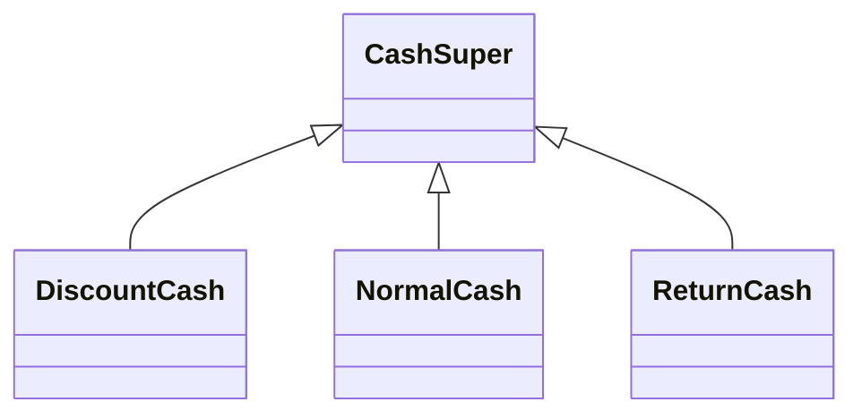
```mermaid
classDiagram
CashSuper <|-- DiscountCash
CashSuper <|--NormalCash 
CashSuper <|--ReturnCash 
```

三种类对应三种计算方式

效果：减少需求对程序的更改，不同需求只需要调用相应的Cash即可。

---

### 策略模式

> 封装变化

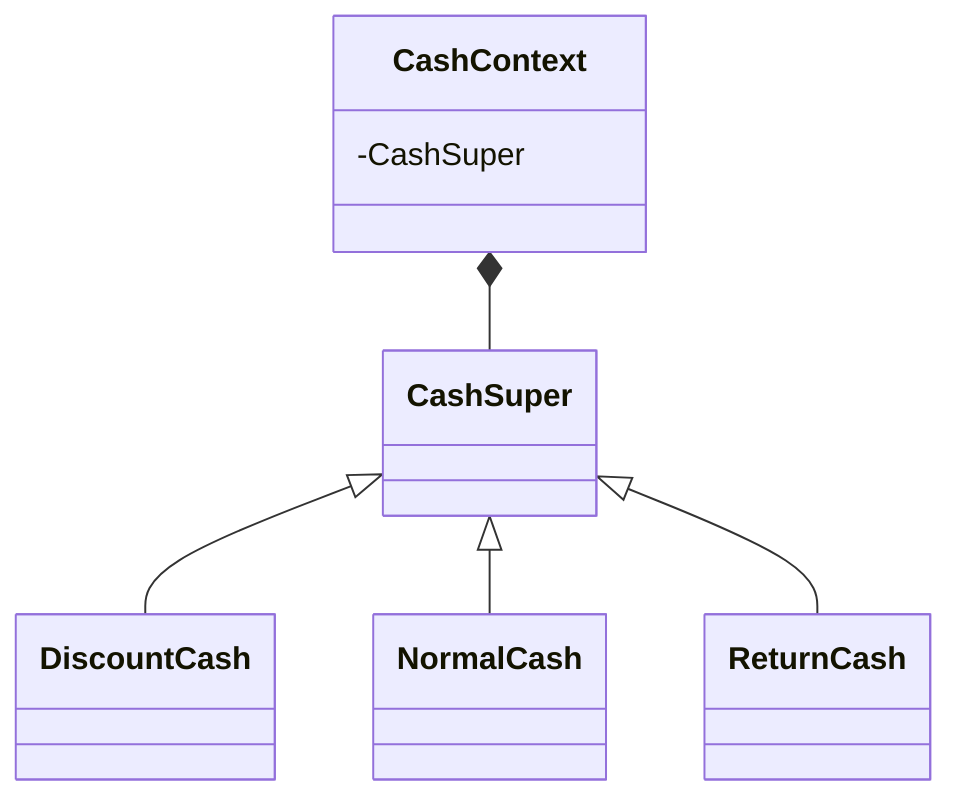
```mermaid
classDiagram
class CashContext{-CashSuper}
CashContext *-- CashSuper
CashSuper <|-- DiscountCash
CashSuper <|--NormalCash 
CashSuper <|--ReturnCash 
```

效果：进一步解耦合，用户只需要知道CashContext就可以得到计算结果了。

---

### 备忘录模式

> 又称【快照模式】：捕获对象状态

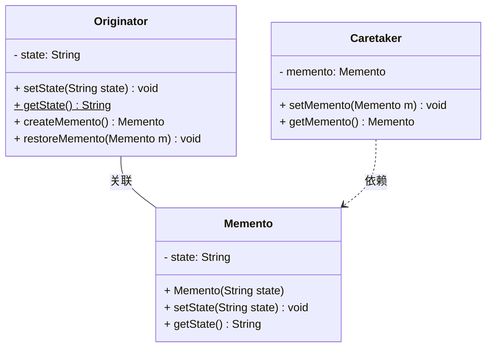
```mermaid
classDiagram
    class Originator {
        - state: String
        + setState(String state) void
        + getState()$ String
        + createMemento() Memento
        + restoreMemento(Memento m) void
    }

    class Caretaker {
        - memento: Memento
        + setMemento(Memento m) void
        + getMemento() Memento
    }

    class Memento {
        - state: String
        + Memento(String state)
        + setState(String state) void
        + getState() String
    }


    Originator -- Memento : 关联
    Caretaker ..> Memento : 依赖
```

- 发起者Originator：执行创建memento 备忘录，获取、设置备忘录状态
- 管理者Caretaker：获取、设置整个备忘录，但是没办法修改备忘录内部的内容

**实现效果**：

- 支持撤销操作
- 不破坏封装保存状态

---

### 代理模式

> 为其他对象提供代理控制访问

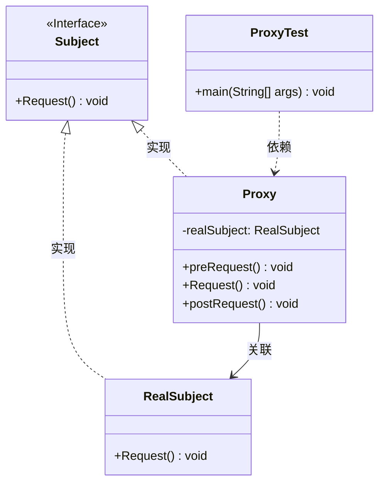
```mermaid
classDiagram
    class Subject {
        <<Interface>>
        +Request() void
    }

    class RealSubject {
        +Request() void
    }

    class Proxy {
        -realSubject: RealSubject
        +preRequest() void
        +Request() void
        +postRequest() void
    }

    class ProxyTest {
        +main(String[] args) void
    }

    Subject <|.. RealSubject : 实现
    Subject <|.. Proxy : 实现
    Proxy --> RealSubject : 关联
    ProxyTest ..> Proxy : 依赖
```

- **实现效果**：
  - 控制对象访问 （保护真实对象）
  - 添加额外功能（延迟加载、访问控制等）

---

### 单例模式

---

### 迭代器模式

> 统一遍历接口，STL的迭代器，都是遵循这个模式。日常编码很少用，除去要新开一个聚合结构体MyStruct

---

### 访问者模式

> 根据身份的不同，每个人员的访问内容的进行的操作也不同
>
> 面对一个**由许多不同类型的对象组成的复杂对象结构**（例如，树形结构、组合结构），并且需要**对该结构中的所有元素执行多种不同操作**时 使用访问者模式

1. 如果一个数据类要满足所有访问者的需求，就需要**新增很多”访问“方法**。会让数据类变得十分冗余。
2. 并且每个数据类都有不同的“访问”方法，每次调用都需要找到相应的数据类的访问方法，操作逻辑分散


访问者模式就是解决这些问题：

1. **新增访问者角色**：每个角色拥有独立的操作数据的方法，将数据类的访问方法解偶出来
2. **新增对象结构**：管理各个具体数据类，通过list（抽象元素类），“接待”访问者完成**所有**元素的访问

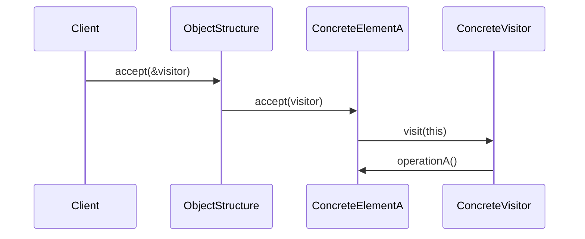
```mermaid
sequenceDiagram
    participant Client
    participant ObjectStructure
    participant ConcreteElementA
    participant ConcreteVisitor
    Client->>ObjectStructure: accept(&visitor)
    ObjectStructure->>ConcreteElementA: accept(visitor)
    ConcreteElementA->>ConcreteVisitor: visit(this)
    ConcreteVisitor->>ConcreteElementA: operationA()
```

- ✅ 操作扩展性：添加新操作只需新增访问者类（无需修改元素类）
- ✅ 数据结构稳定：元素类结构变化频率较低时最有效
- ⚠️ 元素扩展成本：新增元素类型需修改所有访问者类

---

### 观察者模式

> 观察者模式（Observer Pattern）是一种**行为型设计模式**，用于建立对象间一对多的依赖关系，使得当一个对象（被观察者/主题）状态改变时，其所有依赖对象（观察者）会自动收到通知并更新

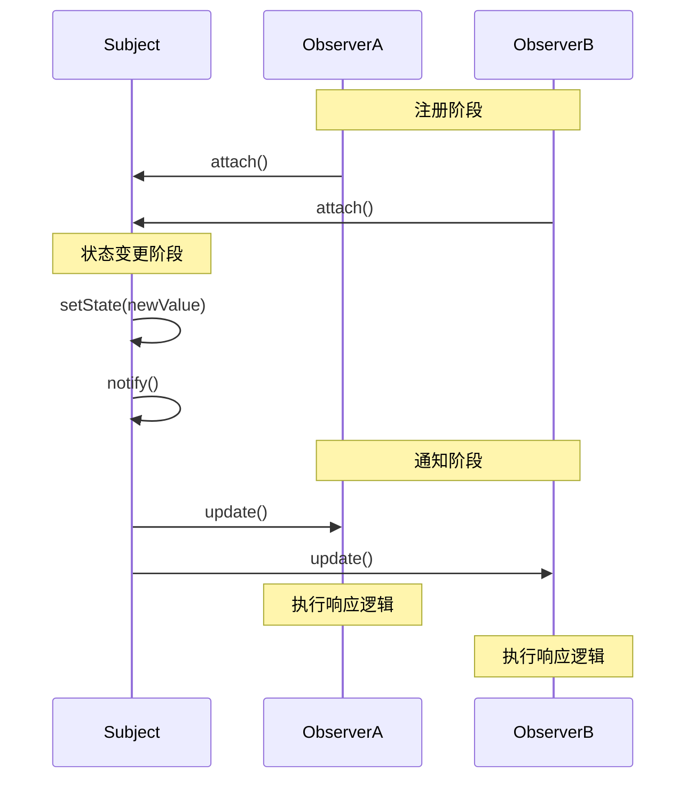
```mermaid
sequenceDiagram
    participant Subject
    participant ObserverA
    participant ObserverB
    
    Note over ObserverA,ObserverB: 注册阶段
    ObserverA->>Subject: attach()
    ObserverB->>Subject: attach()
    
    Note over Subject: 状态变更阶段
    Subject->>Subject: setState(newValue)
    Subject->>Subject: notify()
    
    Note over ObserverA,ObserverB: 通知阶段
    Subject->>ObserverA: update()
    Subject->>ObserverB: update()
    
    Note over ObserverA: 执行响应逻辑
    Note over ObserverB: 执行响应逻辑
```

**模式变体与对比**

1. **推模型 vs 拉模型**
   - 推模型：主题主动将数据传给观察者（如update(temperature)）
   - 拉模型：观察者从主题中主动拉取数据（需主题暴露获取方法getState）
2. **与发布-订阅模式区别**
   - 观察者模式：**直接通信**，主题**持有观察者引用**（因为需要观察者的update方法）。
   - 发布-订阅模式：**通过消息代理间接通信**，彻底解耦（如Redis Pub/Sub）


**优点**

- 松耦合架构：主题不关心观察者具体实现
- 动态订阅：运行时增减观察者
- **通信灵活**：推/拉模型适应不同数据需求

**缺点**

- 通知notify其实是循环执行各个观察者的update，存在性能浪费。

---

### 解释器模式

> 解释器模式用于**定义一种语言的文法规则**，并构建解释器来解释该语言中的表达式。其核心是将语法规则分解为对象，通过递归组合实现复杂逻辑的解析

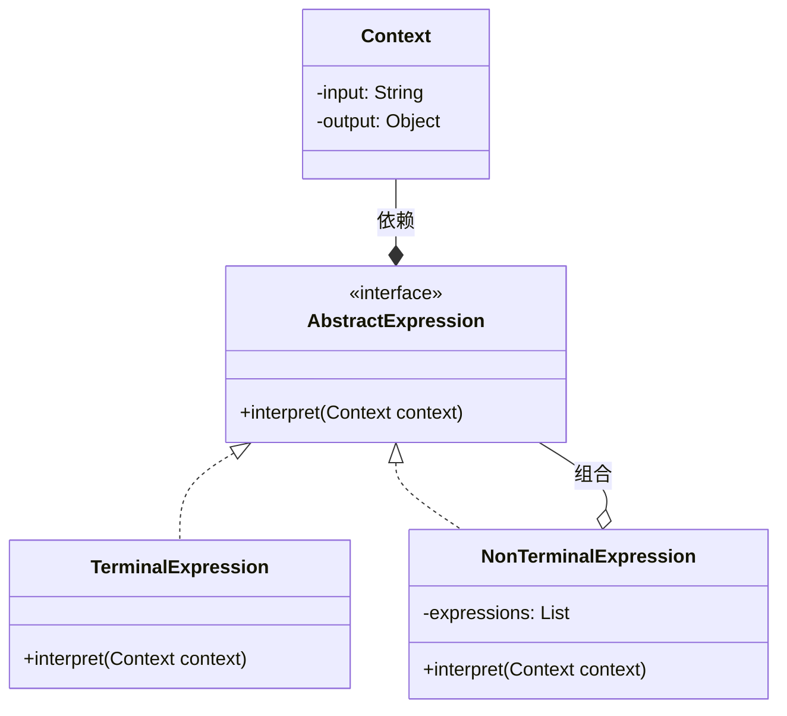
```mermaid
classDiagram 
    class AbstractExpression {
        <<interface>>
        +interpret(Context context)
    }
    class TerminalExpression {
        +interpret(Context context)
    }
    class NonTerminalExpression {
        -expressions: List<AbstractExpression>
        +interpret(Context context)
    }
    class Context {
        -input: String
        -output: Object
    }
    
    AbstractExpression <|.. TerminalExpression
    AbstractExpression <|.. NonTerminalExpression
    NonTerminalExpression o-- AbstractExpression : 组合
    Context --* AbstractExpression : 依赖
```

对应着chat项目，

- 终端表达式可以对应**指标名、定位时间这类的**可以直接从Context上下文中获取

- 非终端表达式可以对应着**select指标表达式**，需要进行解释才能出来。

---

### 命令模式

> 把命令（函数）设计成类，可以将其进行传递---task

---

### 模版方法模式

> **模板方法模式**是一种**行为型设计模式**，通过定义算法的骨架（固定步骤），将某些步骤的具体实现延迟到子类中。

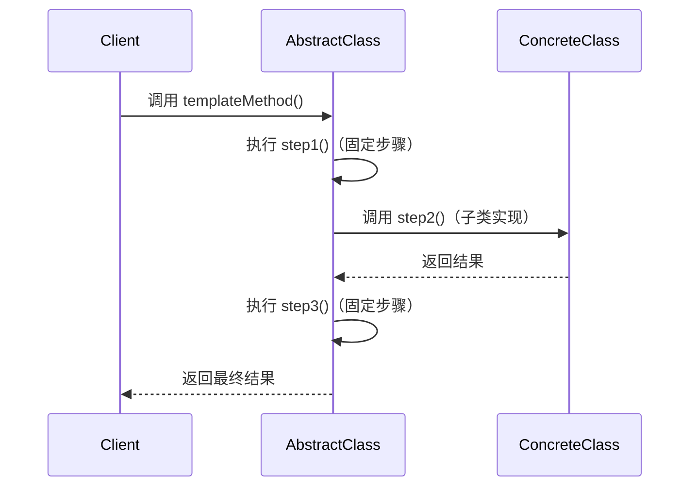
```mermaid
sequenceDiagram
    participant Client
    participant AbstractClass
    participant ConcreteClass
    Client->>AbstractClass: 调用 templateMethod()
    AbstractClass->>AbstractClass: 执行 step1()（固定步骤）
    AbstractClass->>ConcreteClass: 调用 step2()（子类实现）
    ConcreteClass-->>AbstractClass: 返回结果
    AbstractClass->>AbstractClass: 执行 step3()（固定步骤）
    AbstractClass-->>Client: 返回最终结果
```

| **优点**                                   | **缺点**                                                 |
| :----------------------------------------- | :------------------------------------------------------- |
| ✅ **代码复用**：公共逻辑集中父类，避免重复 | ❌ **继承强耦合**：子类依赖父类，修改父类可能影响所有子类 |
| ✅ **扩展灵活**：新增子类即可支持新行为     | ❌ **类膨胀**：每个变体需单独子类，导致类数量过多         |
| ✅ **流程标准化**：确保核心逻辑不可变       | ❌ **灵活性受限**：子类无法修改算法结构（如步骤顺序）     |

---

### 桥接模式

> **桥接模式**是一种**结构型设计模式**，用于将**抽象部分**与**实现部分**分离，使两者能独立变化。解决**继承问题避免因继承导致的类爆炸问题**


---

### 适配器模式

> 适配器模式（Adapter Pattern）是一种**结构型设计模式**，用于解决接口不兼容问题，使原本无法协同工作的类能够协同工作。

1. **目标接口（Target）**
   - 客户端期望的接口规范，定义需实现的方法
2. **被适配者（Adaptee）**
   - 已存在的类或接口，但其接口与目标接口不兼容
3. **适配器（Adapter）**
   - 实现目标接口，并封装被适配者的实例，在目标方法中调用被适配者的方法

---

### 外观模式

> 外观模式是一种**结构型设计模式**，旨在为复杂的子系统提供一个统一的接口，隐藏内部细节，降低客户端与子系统的耦合度。其核心思想是：
>
> - 封装复杂性：通过一个高层接口（外观类）封装多个子系统的交互逻辑
> - **简化调用**：客户端仅需与外观类交互，无需直接调用多个子系统的接口

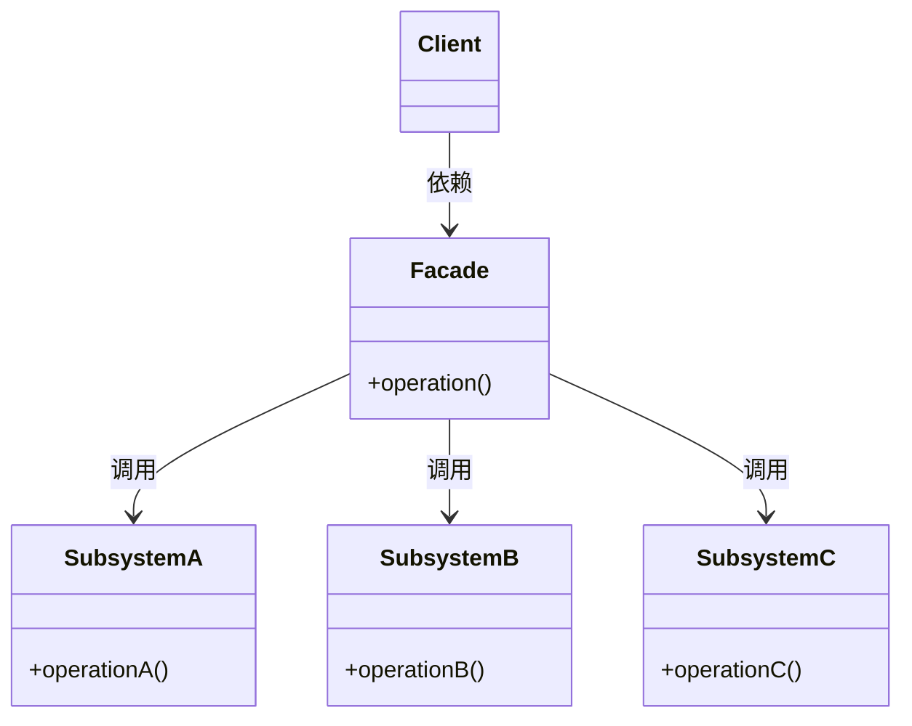
```mermaid
classDiagram
    class Facade {
        +operation()
    }
    class SubsystemA {
        +operationA()
    }
    class SubsystemB {
        +operationB()
    }
    class SubsystemC {
        +operationC()
    }
    
    Facade --> SubsystemA : 调用
    Facade --> SubsystemB : 调用
    Facade --> SubsystemC : 调用
    Client --> Facade : 依赖
```

1. Facade`（外观角色）
   - 提供统一入口，封装子系统的调用逻辑
2. `Subsystem`（子系统角色）
   - 实现具体功能（如CPU;Memory;Light等），对外界透明
3. `Client`（客户端）
   - 通过外观类调用功能，不直接接触子系统

---

### 享元模式

> 享元模式（Flyweight Pattern）是一种**结构型设计模式**，通过共享对象来减少内存占用、优化性能，适用于系统中存在大量相似对象的场景。
>
> 其核心思想是将对象状态分为**内部状态**（可共享、不变）和**外部状态**（不可共享、可变），通过复用内部状态相同的对象来降低资源消耗

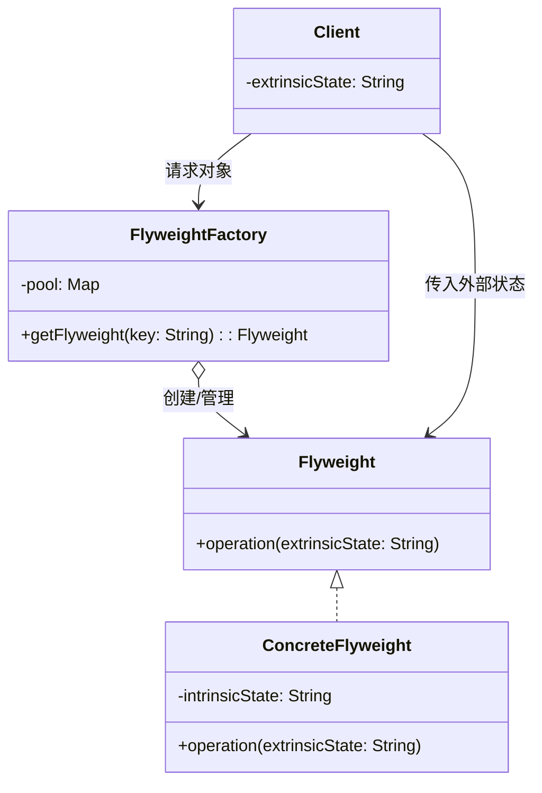
```mermaid
classDiagram
    class FlyweightFactory {
        -pool: Map<String, Flyweight>
        +getFlyweight(key: String): Flyweight
    }
    class Flyweight {
        +operation(extrinsicState: String)
    }
    class ConcreteFlyweight {
        -intrinsicState: String
        +operation(extrinsicState: String)
    }
    class Client {
        -extrinsicState: String
    }
    
    FlyweightFactory o--> Flyweight : 创建/管理
    Flyweight <|.. ConcreteFlyweight
    Client --> FlyweightFactory : 请求对象
    Client --> Flyweight : 传入外部状态
```

1. 抽象享元（Flyweight）
   - 定义操作接口，声明方法参数接收外部状态
2. 具体享元（ConcreteFlyweight）
   - 实现接口，存储内部状态（如 String fontName），处理外部状态
3. 享元工厂（FlyweightFactory）
   - 维护享元池（如HashMap），按需创建或返回现有对象（核心复用逻辑）。
4. 客户端（Client）
   - 存储外部状态，调用工厂获取享元对象并**传入外部状态**

---

### 原型模式

> **原型模式**是一种**创建型设计模式**，通过复制现有对象（原型）创建新对象，避免重复初始化过程。其核心思想是：
>
> - 对象复用：通过克隆（clone()）替代构造函数调用，提升性能并简化对象创建。
> - 动态扩展：支持运行时动态添加或修改对象类型，无需依赖子类继承。
> - 分离创建逻辑：客户端无需了解对象构造细节，仅通过原型接口获取新实例
>
> **关键术语**：
>
> - 浅拷贝：复制对象本身及基本类型字段，但引用类型字段共享（仅复制引用地址）
>
> - 深拷贝：递归复制对象及其所有引用对象，实现完全独立的新对象

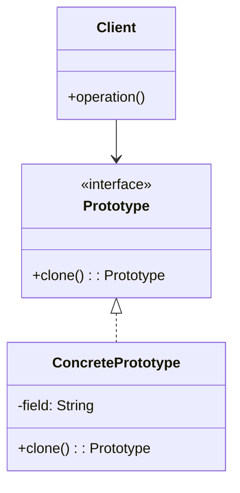
```mermaid
classDiagram
    class Prototype {
        <<interface>>
        +clone(): Prototype
    }
    class ConcretePrototype {
        -field: String
        +clone(): Prototype
    }
    class Client {
        +operation()
    }
    Prototype <|.. ConcretePrototype
    Client --> Prototype
```

**抽象原型（Prototype）**

- 定义克隆接口（如clone()方法），通常为抽象类或接口

---

### 责任链模式

> **责任链模式**是一种**行为型设计模式**，通过将多个处理对象连成一条链，使请求沿链传递直至被处理。其核心思想是：
>
> - 解耦请求与处理：请求发送者无需知道具体处理者，只需将请求提交到**链首**
> - **动态组合处理逻辑**：可灵活调整链中处理者的顺序或增减节点，符合开闭原则
>
> **类比**：公司请假流程（员工→主管→经理→HR），每个审批者根据权限决定处理或传递请求

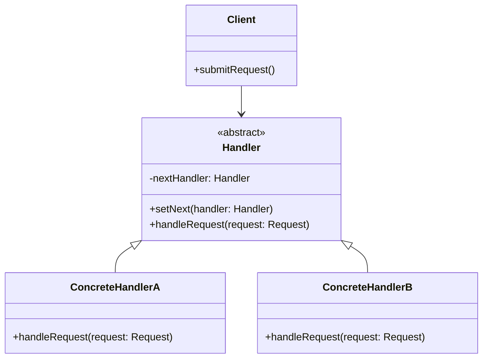
```mermaid
classDiagram
    class Handler {
        <<abstract>>
        -nextHandler: Handler
        +setNext(handler: Handler)
        +handleRequest(request: Request)
    }
    class ConcreteHandlerA {
        +handleRequest(request: Request)
    }
    class ConcreteHandlerB {
        +handleRequest(request: Request)
    }
    class Client {
        +submitRequest()
    }
    Handler <|-- ConcreteHandlerA
    Handler <|-- ConcreteHandlerB
    Client --> Handler
```

| **优点**                                                   | **缺点**                                                   |
| :--------------------------------------------------------- | :--------------------------------------------------------- |
| ✅ **解耦请求与处理**：发送者无需知悉处理细节。             | ❌ **性能开销**：长链传递增加响应时间。                     |
| ✅ **灵活扩展**：动态增删处理节点，符合开闭原则。           | ❌ **调试困难**：请求路径复杂，问题定位耗时。               |
| ✅ **责任单一化**：每个处理者专注自身逻辑（如校验、审批）。 | ❌ **请求丢失风险**：若**无兜底处理者**，请求可能未被处理。 |

---

### 中介者模式

> 中介者模式（Mediator Pattern）是一种**行为型设计模式**，通过引入一个中介对象来封装多个对象间的复杂交互，将网状耦合结构转化为**星型结构**，从而降低系统复杂度。
>
> - 解耦对象交互：将多对多的对象通信转化为一对多关系（中介者与各对象交互），避免对象间直接引用。
> - **集中控制逻辑**：中介者封装协调逻辑，对象只需与中介者通信，无需知晓其他对象细节，符合**迪米特法则**
>
> 智能家居

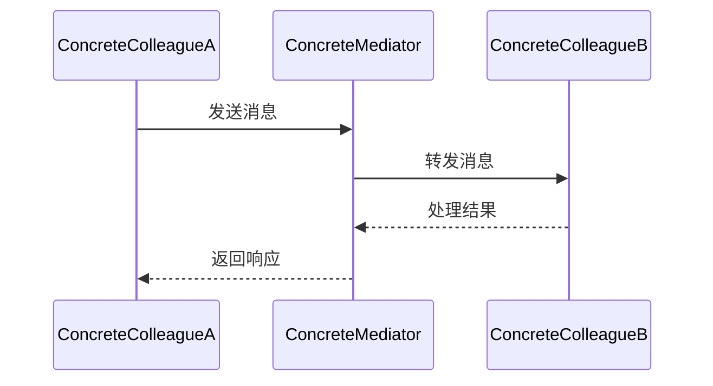
```mermaid
sequenceDiagram
    participant A as ConcreteColleagueA
    participant M as ConcreteMediator
    participant B as ConcreteColleagueB
    A->>M: 发送消息
    M->>B: 转发消息
    B-->>M: 处理结果
    M-->>A: 返回响应
```

|      角色      | 职责                                                         |
| :------------: | :----------------------------------------------------------- |
| **抽象中介者** | 定义通信接口，管理同事对象的注册与消息转发（如 `Mediator` 接口） |
| **具体中介者** | 实现协调逻辑，维护**同事对象集合**（如 `ConcreteMediator`）  |
| **抽象同事类** | 定义与中介者的通信方法（如 `Colleague` 类）                  |
| **具体同事类** | 实现业务逻辑，通过中介者与其他同事通信（如 `Alarm`、`TV` 等） |

---

### 装饰模式

> 装饰模式（Decorator Pattern）是一种**结构型设计模式**，通过动态组合而非继承的方式扩展对象功能，保持代码的灵活性和可扩展性。
>
> **场景：咖啡馆点单系统**
>
> - 基础构件：Coffee（基础咖啡，价格10元）。
> - **装饰器**：`MilkDecorator`（加牛奶，+2元）、`ChocolateDecorator`（加巧克力，+3元）

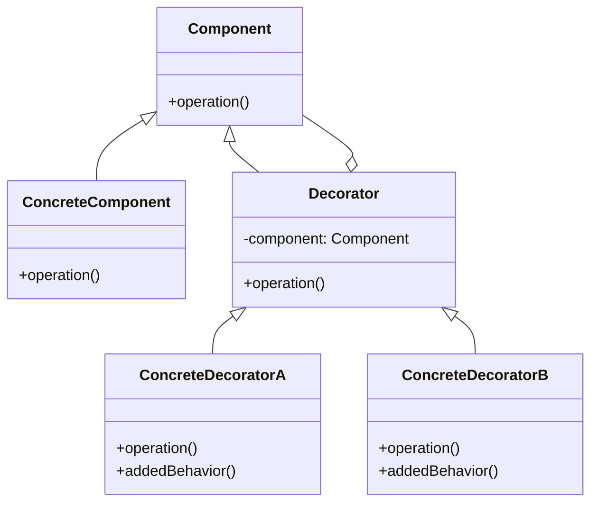
```mermaid
classDiagram
    class Component {
        +operation()
    }
    class ConcreteComponent {
        +operation()
    }
    class Decorator {
        -component: Component
        +operation()
    }
    class ConcreteDecoratorA {
        +operation()
        +addedBehavior()
    }
    class ConcreteDecoratorB {
        +operation()
        +addedBehavior()
    }
    Component <|-- ConcreteComponent
    Component <|-- Decorator
    Decorator <|-- ConcreteDecoratorA
    Decorator <|-- ConcreteDecoratorB
    Decorator o-- Component
```

---

### 状态模式

> 状态模式（State Pattern）是一种**行为型设计模式**，允许对象在其内部状态改变时改变其行为，使对象的行为看起来像是修改了它的类

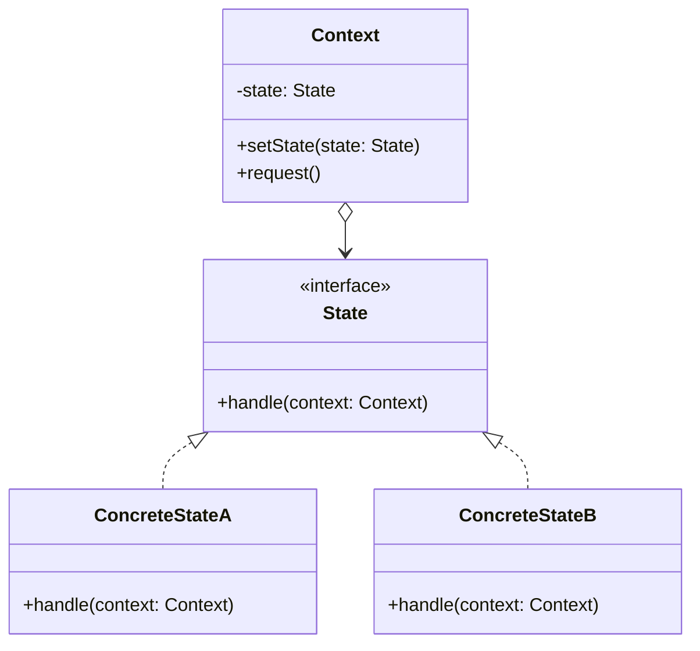
```mermaid
classDiagram
    class Context {
        -state: State
        +setState(state: State)
        +request()
    }
    class State {
        <<interface>>
        +handle(context: Context)
    }
    class ConcreteStateA {
        +handle(context: Context)
    }
    class ConcreteStateB {
        +handle(context: Context)
    }
    Context o--> State
    State <|.. ConcreteStateA
    State <|.. ConcreteStateB
```

| **优点**                                                     | **缺点**                                                     |
| :----------------------------------------------------------- | :----------------------------------------------------------- |
| ✅ **消除条件分支**：避免复杂的`if-else`逻辑，代码更清晰。    | ❌ **类数量增加**：每个状态需一个类，可能过度设计。           |
| ✅ **易于扩展**：新增状态只需添加类，无需修改上下文（符合开闭原则）。 | ❌ **状态转换耦合**：状态类需持有上下文引用，可能引入循环依赖。 |
| ✅ **集中状态逻辑**：每个状态的行为局部化，便于维护。         | ❌ **性能开销**：频繁状态切换可能增加对象创建成本（可结合享元模式优化）。 |

---

### 组合模式

>  组合模式（Composite Pattern）是一种**结构型设计模式**，用于将对象组合成树形结构以表示“部分-整体”的层次关系，使客户端能够以统一的方式处理单个对象和组合对象

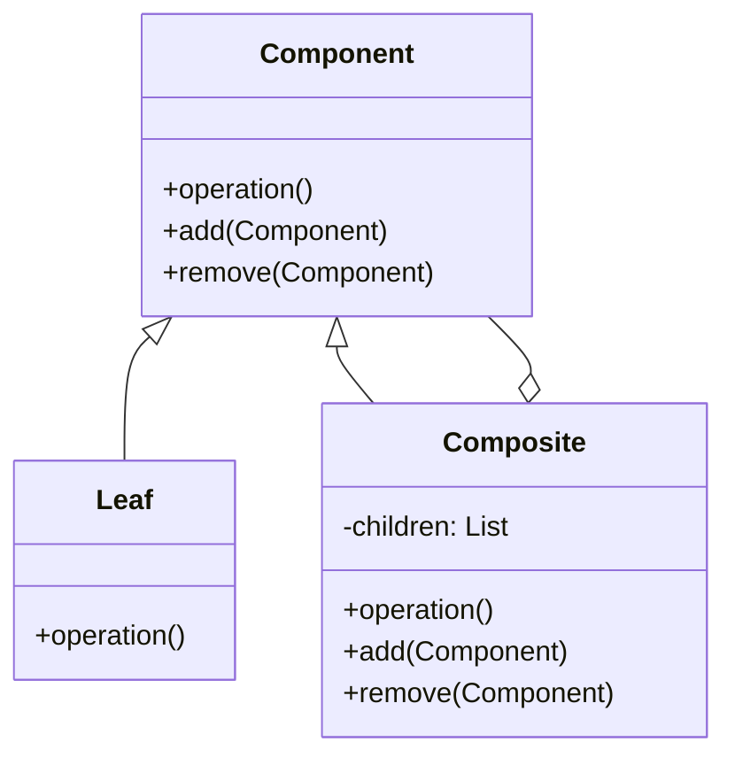
```mermaid
classDiagram
    class Component {
        +operation()
        +add(Component)
        +remove(Component)
    }
    class Leaf {
        +operation()
    }
    class Composite {
        -children: List<Component>
        +operation()
        +add(Component)
        +remove(Component)
    }
    Component <|-- Leaf
    Component <|-- Composite
    Composite o-- Component
```

| **角色**                  | **职责**                                                     |
| :------------------------ | :----------------------------------------------------------- |
| **抽象组件（Component）** | 声明所有对象的通用接口（如`operation()`），可定义默认行为（如管理子组件的方法）。 |
| **叶子节点（Leaf）**      | 树形结构的末端节点，无子节点，实现具体业务逻辑（如文件显示、员工信息）。 |
| **组合节点（Composite）** | 存储子组件集合，实现管理子组件的方法（如`add()`、`remove()`），递归调用子组件操作。 |
